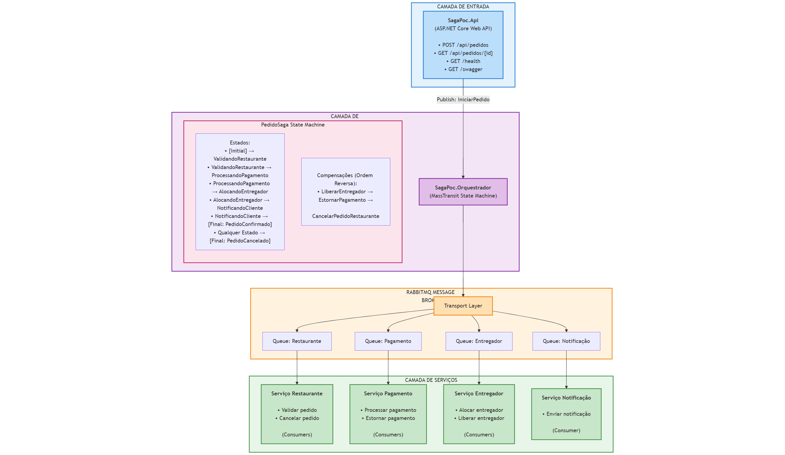
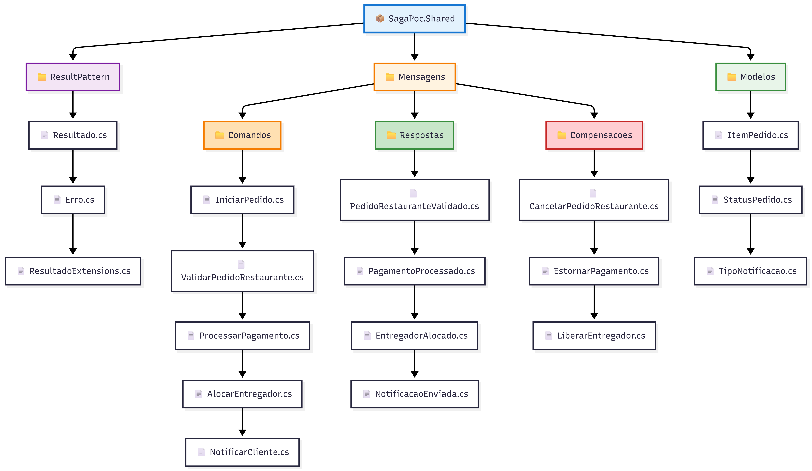

# Arquitetura - POC SAGA Pattern

Este documento detalha a arquitetura da POC, decisões técnicas, padrões utilizados e fluxos de comunicação entre os componentes.

---

## Visão Geral da Arquitetura

### Arquitetura de Alto Nível


---

## Componentes Principais

### 1. **SagaPoc.Api** (Camada de Entrada)

**Responsabilidade**: Ponto de entrada HTTP para os clientes.

**Tecnologias**:
- ASP.NET Core 8.0
- Swagger/OpenAPI
- MassTransit (IPublishEndpoint)

**Endpoints**:
```csharp
POST   /api/pedidos              # Criar novo pedido
GET    /api/pedidos/{id}/status  # Consultar status do pedido
GET    /health                   # Health check
```

**Fluxo**:
1. Recebe requisição HTTP (POST /api/pedidos)
2. Valida o payload (DataAnnotations)
3. Gera um `CorrelationId` único (Guid)
4. Publica mensagem `IniciarPedido` no Azure Service Bus
5. Retorna **202 Accepted** com o `PedidoId`

**Características**:
- Stateless (não mantém estado do pedido)
- Assíncrono (fire-and-forget)
- Idempotente (aceita múltiplas requisições com mesmo payload)

---

### 2. **SagaPoc.Orquestrador** (Camada de Orquestração)

**Responsabilidade**: Coordenar o fluxo da SAGA e gerenciar o estado.

**Tecnologias**:
- MassTransit State Machine
- Azure Service Bus
- In-Memory Saga Repository (POC) - **Para produção: SQL Server ou Redis**

**Componentes**:
- `PedidoSaga` - State Machine (lógica de transições)
- `EstadoPedido` - Estado da SAGA (dados persistidos)

**Estados da SAGA**:


**Eventos Tratados**:
- `IniciarPedido` → Inicia a SAGA
- `PedidoRestauranteValidado` → Resultado da validação
- `PagamentoProcessado` → Resultado do pagamento
- `EntregadorAlocado` → Resultado da alocação
- `NotificacaoEnviada` → Confirmação de notificação

**Decisões Arquiteturais**:
1. **Por que State Machine?**
   - Controle centralizado do fluxo
   - Fácil visualização dos estados
   - Compensações automáticas

2. **Por que InMemory para POC?**
   - Simplicidade (sem setup de banco)
   - Rápido para testes
   - **Não usar em produção** (perde estado ao reiniciar)

---

### 3. **Serviços de Domínio** (Camada de Serviços)

Cada serviço é um **Worker Service** independente que consome mensagens do Azure Service Bus.

#### 3.1 **SagaPoc.ServicoRestaurante**

**Responsabilidade**: Validar disponibilidade do restaurante e dos itens.

**Consumers**:
- `ValidarPedidoRestauranteConsumer` → Valida o pedido
- `CancelarPedidoRestauranteConsumer` → Cancela o pedido (compensação)

**Lógica de Validação**:


**Compensação**:
```csharp
CancelarPedidoRestaurante
   ↓
Marca o pedido como cancelado no sistema do restaurante
Libera o estoque reservado (se aplicável)
```

---

#### 3.2 **SagaPoc.ServicoPagamento**

**Responsabilidade**: Processar pagamentos e estornos.

**Consumers**:
- `ProcessarPagamentoConsumer` → Processa o pagamento
- `EstornarPagamentoConsumer` → Estorna o pagamento (compensação)

**Lógica de Processamento**:
```csharp
// Casos de rejeição:
- ClienteId == "CLI_CARTAO_RECUSADO" → Pagamento recusado
- ClienteId == "CLI_TIMEOUT" → Timeout no gateway
- Valor > 1000.00 → Análise de fraude (simulado)

// Casos de sucesso:
- Gera TransacaoId único
- Retorna: PagamentoProcessado
```

**Compensação (Estorno)**:
```csharp
EstornarPagamento
   ↓
Valida TransacaoId
Processa estorno no gateway de pagamento
Gera comprovante de estorno
Idempotente: Executar 2x não duplica estorno
```

**Idempotência**:
```csharp
// Verificar se já foi estornado:
if (await _repositorio.JaEstornadoAsync(transacaoId))
{
    _logger.LogWarning("Estorno já processado (idempotente)");
    return Resultado.Sucesso();
}
```

---

#### 3.3 **SagaPoc.ServicoEntregador**

**Responsabilidade**: Alocar entregadores disponíveis.

**Consumers**:
- `AlocarEntregadorConsumer` → Aloca entregador
- `LiberarEntregadorConsumer` → Libera o entregador (compensação)

**Lógica de Alocação**:
```csharp
// Casos de indisponibilidade:
- Endereço contém "LONGE" ou "DISTANTE"
- Todos os entregadores ocupados
- Restaurante fora da área de cobertura

// Casos de sucesso:
- Calcula distância (simulada)
- Aloca entregador disponível
- Calcula tempo estimado (15-30min base + distância)
- Reduz 30% do tempo para pedidos VIP
```

**Compensação (Liberar)**:
```csharp
LiberarEntregador
   ↓
Marca o entregador como disponível novamente
Cancela a rota alocada
```

---

#### 3.4 **SagaPoc.ServicoNotificacao**

**Responsabilidade**: Notificar o cliente sobre o status do pedido.

**Consumers**:
- `NotificarClienteConsumer` → Envia notificação

**Tipos de Notificação**:
```csharp
enum TipoNotificacao
{
    PedidoConfirmado,
    PedidoCancelado,
    EntregadorAlocado,
    PedidoEmPreparacao,
    PedidoSaiuParaEntrega,
    PedidoEntregue
}
```

**Canais de Notificação** (simulados):
- Email
- SMS
- Push Notification
- WhatsApp

**Tratamento de Falha**:
```csharp
// Notificação NÃO é crítica:
if (ClienteId == "CLI_SEM_NOTIFICACAO")
{
    _logger.LogWarning("Cliente sem notificações habilitadas");
    return Resultado.Sucesso(); // ✅ Não cancela o pedido
}
```
---

### 4. **SagaPoc.Shared** (Camada Compartilhada)

**Responsabilidade**: Contratos, modelos e utilitários compartilhados.

**Estrutura**:



---

## 🔄 Padrões de Design Implementados

### 1. **SAGA Orquestrado (Orchestrated SAGA)**

**O que é?**
- Padrão para transações distribuídas em microsserviços
- Um orquestrador central coordena o fluxo
- Cada serviço executa sua operação local

**Por que Orquestrado (vs Coreografado)?**

| Orquestrado | Coreografado |
|-------------|--------------|
| ✅ Controle centralizado | ❌ Lógica espalhada |
| ✅ Fácil debug e rastreamento | ❌ Difícil rastrear fluxo completo |
| ✅ Compensações explícitas | ❌ Cada serviço conhece os outros |
| ⚠️ Orquestrador é ponto único | ✅ Sem ponto único de falha |

**Trade-off**: Escolhemos orquestrado porque:
- POC educacional (mais fácil de entender)
- Fluxo linear claro
- Melhor observabilidade

---

### 2. **Result Pattern**

**O que é?**
Padrão funcional para encapsular sucesso/falha **sem exceções**.

**Estrutura**:
```csharp
public class Resultado<T>
{
    public bool EhSucesso { get; }
    public bool EhFalha => !EhSucesso;
    public T Valor { get; }
    public Erro Erro { get; }

    public static Resultado<T> Sucesso(T valor) => new(valor, null);
    public static Resultado<T> Falha(string mensagem) => new(default, new Erro(mensagem));
}
```

**Por que Result Pattern?**

**Sem Result Pattern** (exceções):
```csharp
try
{
    var pagamento = await ProcessarPagamento();
    var entregador = await AlocarEntregador();
}
catch (PagamentoException ex)
{
    await EstornarPagamento();
    throw;
}
```

**Com Result Pattern**:
```csharp
var resultadoPagamento = await ProcessarPagamento();
if (resultadoPagamento.EhFalha)
{
    await EstornarPagamento();
    return Resultado.Falha(resultadoPagamento.Erro.Mensagem);
}

var resultadoEntregador = await AlocarEntregador();
// ...
```

**Benefícios**:
- Sem try/catch (código mais limpo)
- Erros explícitos no tipo de retorno
- Composição fluente (`Map`, `Bind`)
- Performance (sem overhead de exceções)

---

### 3. **Request/Response Pattern** (MassTransit)

**O que é?**
Comunicação síncrona sobre infraestrutura assíncrona.

**Fluxo**:
```
[Orquestrador]
    ↓ Request: ValidarPedidoRestaurante
    ↓ (via Azure Service Bus)
[Serviço Restaurante]
    ↓ Processa validação
    ↓ Response: PedidoRestauranteValidado
[Orquestrador]
    ↓ Recebe resposta e continua SAGA
```

**Configuração (MassTransit)**:
```csharp
// No Orquestrador (State Machine):
.Publish(context => new ValidarPedidoRestaurante(...))

// No Serviço:
await context.RespondAsync(new PedidoRestauranteValidado(...));
```

**Por que Request/Response?**
- State Machine precisa esperar resposta para decidir próximo estado
- Alternativa seria Publish/Subscribe (assíncrono completo)

---

### 4. **Compensating Transaction Pattern**

**O que é?**
Desfazer operações já executadas quando ocorre falha.

**Exemplo (Caso 5 - Sem Entregador)**:
```
1. Restaurante validou → Pedido criado
2. Pagamento aprovado → Cobrança feita
3. Entregador indisponível → FALHA

Compensações (ordem reversa):
   2. Estornar pagamento
   1. Cancelar pedido no restaurante
```

**Implementação no State Machine**:
```csharp
During(AlocandoEntregador,
    When(EntregadorAlocado)
        .IfElse(context => context.Message.Alocado,
            alocado => alocado
                .TransitionTo(NotificandoCliente)
                .Publish(...),
            semEntregador => semEntregador
                // COMPENSAÇÃO: Estornar pagamento
                .Publish(context => new EstornarPagamento(
                    context.Saga.CorrelationId,
                    context.Saga.TransacaoId!
                ))
                .TransitionTo(PedidoCancelado)
        )
);
```

**Características das Compensações**:
- **Idempotente**: Rodar 2x não causa efeitos colaterais
- **Best-effort**: Tenta executar, mas pode falhar
- **Logged**: Todas as compensações são logadas

---

## 🔌 Comunicação e Mensageria

### Azure Service Bus (Transport Layer)

**Configuração**:
```csharp
services.AddMassTransit(x =>
{
    x.UsingAzureServiceBus((context, cfg) =>
    {
        cfg.Host(configuration["AzureServiceBus:ConnectionString"]);
        cfg.ConfigureEndpoints(context); // Cria filas automaticamente
    });
});
```

**Filas Criadas Automaticamente**:
```
saga-poc-dotnet.servicebus.windows.net/
├── fila-restaurante              (Comandos para Serviço Restaurante)
├── fila-pagamento                (Comandos para Serviço Pagamento)
├── fila-entregador               (Comandos para Serviço Entregador)
├── fila-notificacao              (Comandos para Serviço Notificação)
└── fila-orquestrador-saga        (Eventos da SAGA)
```

**Dead Letter Queue (DLQ)**:
- Mensagens que falharam após N tentativas vão para DLQ
- Azure Service Bus gerencia automaticamente

---

### Contratos de Mensagem (Strongly Typed)

**Comandos** (Requests):
```csharp
public record ValidarPedidoRestaurante(
    Guid CorrelacaoId,
    string RestauranteId,
    List<ItemPedido> Itens
);
```

**Respostas** (Responses):
```csharp
public record PedidoRestauranteValidado(
    Guid CorrelacaoId,
    bool Valido,
    decimal ValorTotal,
    int TempoPreparoMinutos,
    string? MotivoRejeicao
);
```

**Por que Records?**
- Imutáveis por padrão
- Equality by value (útil para testes)
- Sintaxe concisa
- Serialização JSON automática

---

## Persistência e Estado

### Estado da SAGA

**Modelo**:
```csharp
public class EstadoPedido : SagaStateMachineInstance
{
    public Guid CorrelationId { get; set; }      // Chave primária
    public string EstadoAtual { get; set; }       // Estado atual da State Machine

    // Dados do Pedido
    public string ClienteId { get; set; }
    public string RestauranteId { get; set; }
    public decimal ValorTotal { get; set; }
    public string EnderecoEntrega { get; set; }

    // Controle de Compensação
    public string? TransacaoId { get; set; }      // Para estorno
    public string? EntregadorId { get; set; }     // Para liberação
    public Guid? PedidoRestauranteId { get; set; } // Para cancelamento

    // Timestamps
    public DateTime DataInicio { get; set; }
    public DateTime? DataConclusao { get; set; }
}
```

**Persistência (POC vs Produção)**:

| Ambiente | Repository | Persistência | Quando usar |
|----------|-----------|--------------|-------------|
| **POC** | InMemory | RAM | Testes, desenvolvimento |
| **Produção** | EntityFramework + SQL | Banco relacional | Auditoria, consistência ACID |
| **Produção** | Redis | Cache distribuído | Alta performance |

**Configuração SQL (Produção)**:
```csharp
x.AddSagaStateMachine<PedidoSaga, EstadoPedido>()
    .EntityFrameworkRepository(r =>
    {
        r.ConcurrencyMode = ConcurrencyMode.Optimistic;
        r.AddDbContext<DbContext, SagaDbContext>((provider, builder) =>
        {
            builder.UseSqlServer(connectionString);
        });
    });
```

---

## Confiabilidade e Resiliência

### 1. **Retry Policy**

**Configuração (Produção)**:
```csharp
cfg.UseMessageRetry(r =>
{
    r.Exponential(
        retryLimit: 5,
        minInterval: TimeSpan.FromSeconds(1),
        maxInterval: TimeSpan.FromSeconds(30),
        intervalDelta: TimeSpan.FromSeconds(5)
    );
    r.Ignore<ValidationException>(); // Não retry erros de validação
});
```

**Estratégia**:
- 1ª tentativa: imediata
- 2ª tentativa: após 1s
- 3ª tentativa: após 6s
- 4ª tentativa: após 16s
- 5ª tentativa: após 30s
- Após 5 falhas: Dead Letter Queue

---

### 2. **Idempotência**

**Problema**: Retry pode processar a mesma mensagem 2x.

**Solução**: Verificar se já foi processado.

```csharp
public async Task Consume(ConsumeContext<EstornarPagamento> context)
{
    var messageId = context.MessageId.ToString();

    if (await _idempotencia.JaProcessadoAsync(messageId))
    {
        _logger.LogWarning("Estorno já processado (duplicado)");
        return; // Ignorar
    }

    // Processar estorno...

    await _idempotencia.MarcarProcessadaAsync(messageId);
}
```

---

### 3. **Circuit Breaker** (Produção)

**Configuração**:
```csharp
cfg.UseCircuitBreaker(cb =>
{
    cb.TrackingPeriod = TimeSpan.FromMinutes(1);
    cb.TripThreshold = 15;  // Abre após 15 falhas em 1min
    cb.ActiveThreshold = 10; // Fecha após 10 sucessos
    cb.ResetInterval = TimeSpan.FromMinutes(5);
});
```

---

## Observabilidade

### Logging Estruturado (Serilog)

**Configuração**:
```csharp
Log.Logger = new LoggerConfiguration()
    .Enrich.FromLogContext()
    .Enrich.WithProperty("Servico", "SagaPoc.Orquestrador")
    .WriteTo.Console(outputTemplate:
        "[{Timestamp:HH:mm:ss} {Level:u3}] {Message:lj} {Properties:j}{NewLine}{Exception}")
    .CreateLogger();
```

**Campos Logados**:
- `CorrelationId` - Rastreamento end-to-end
- `EstadoAtual` - Estado da SAGA
- `Servico` - Qual serviço gerou o log
- `Timestamp` - Data/hora
- `Duracao` - Tempo de execução

**Exemplo de Log**:
```json
{
  "Timestamp": "2026-01-07T16:45:32Z",
  "Level": "Information",
  "Message": "Pedido validado com sucesso",
  "Properties": {
    "CorrelationId": "a1b2c3d4-e5f6-7890-abcd-ef1234567890",
    "RestauranteId": "REST001",
    "ValorTotal": 45.90,
    "TempoPreparo": 10,
    "Servico": "SagaPoc.ServicoRestaurante"
  }
}
```

---

### Rastreamento Distribuído (Distributed Tracing)

**Ferramentas Recomendadas**:
- **OpenTelemetry** + Application Insights
- **Jaeger**
- **Zipkin**

**Trace de uma SAGA completa**:
```
[Trace: a1b2c3d4]
├── [Span] POST /api/pedidos (75ms)
├── [Span] ValidarPedidoRestaurante (150ms)
├── [Span] ProcessarPagamento (450ms)
├── [Span] AlocarEntregador (220ms)
└── [Span] NotificarCliente (80ms)
Total: 975ms
```

---

## Decisões Arquiteturais

### Por que MassTransit (e não outros)?

| Alternativa | Prós | Contras | Quando usar |
|-------------|------|---------|-------------|
| **MassTransit** | State Machine integrada, Retry/CB embutidos, Abstração sobre transportes | Curva de aprendizado | ✅ SAGA complexas, múltiplos transportes |
| **NServiceBus** | Mais maduro, suporte enterprise | Pago | Enterprise |
| **Rebus** | Leve, simples | Sem State Machine | Mensageria simples |
| **RabbitMQ direto** | Controle total | Muito boilerplate | Necessita customização extrema |

---

### Por que Azure Service Bus (e não RabbitMQ/Kafka)?

| Transport | Prós | Contras | Quando usar |
|-----------|------|---------|-------------|
| **Azure Service Bus** | Gerenciado, Dead Letter Queue, garantia de ordem | Custo | ✅ Cloud Azure, POC rápida |
| **RabbitMQ** | Open-source, flexível | Gerenciar infraestrutura | On-premise |
| **Kafka** | Alta vazão, log distribuído | Overkill para SAGA | Event Sourcing, analytics |

---

## Segurança (Produção)

### 1. **Managed Identity**

Eliminar connection strings hardcoded:
```csharp
cfg.Host(new Uri("sb://namespace.servicebus.windows.net"), h =>
{
    h.TokenCredential = new DefaultAzureCredential();
});
```

### 2. **Encryption at Rest**

Azure Service Bus criptografa mensagens automaticamente.

### 3. **Encryption in Transit**

HTTPS/TLS para API, AMQP over TLS para Service Bus.

---

## Referências

- **[plano-execucao.md](./plano-execucao.md)** - Plano completo do projeto
- **[guia-masstransit.md](./guia-masstransit.md)** - Guia do MassTransit
- **[casos-uso.md](./casos-uso.md)** - 12 cenários implementados
- **[MassTransit Documentation](https://masstransit.io/)** - Documentação oficial
- **[SAGA Pattern - Microsoft](https://docs.microsoft.com/azure/architecture/reference-architectures/saga/saga)**

---

**Documento criado em**: 2026-01-07
**Versão**: 1.0
**Status**: Completo
