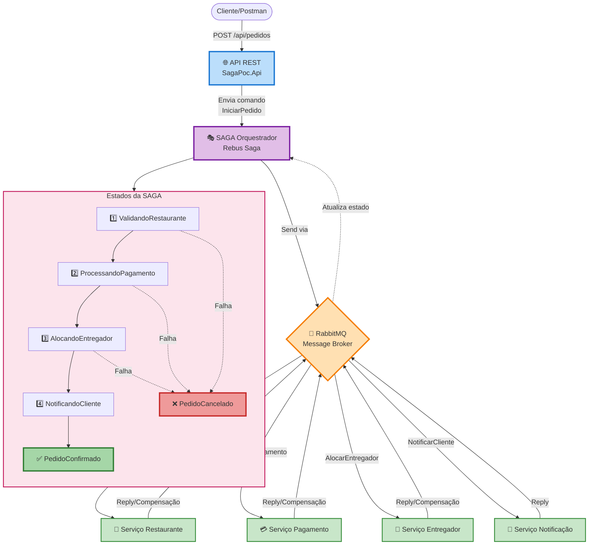
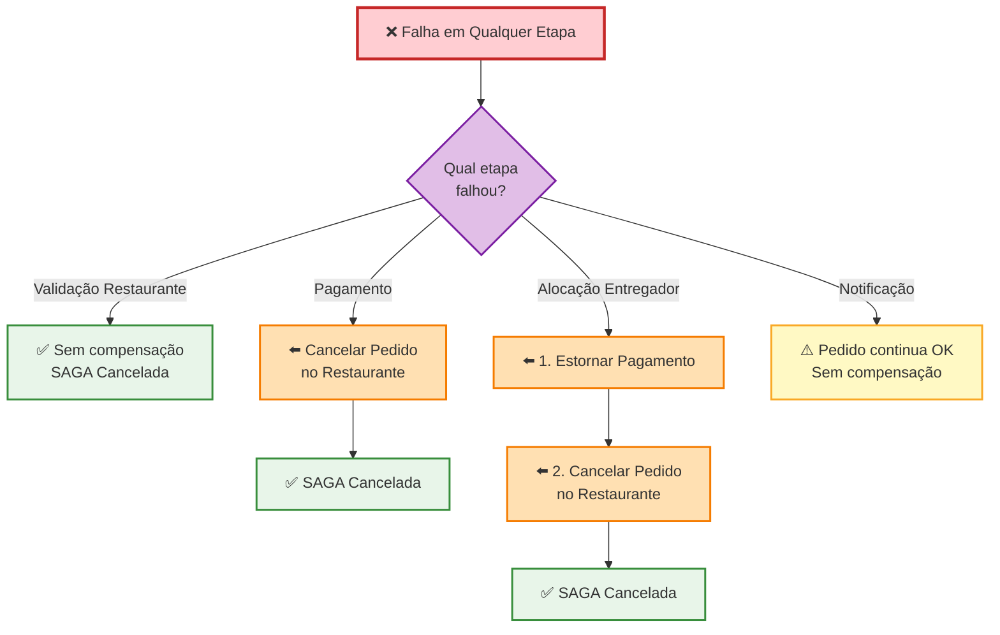
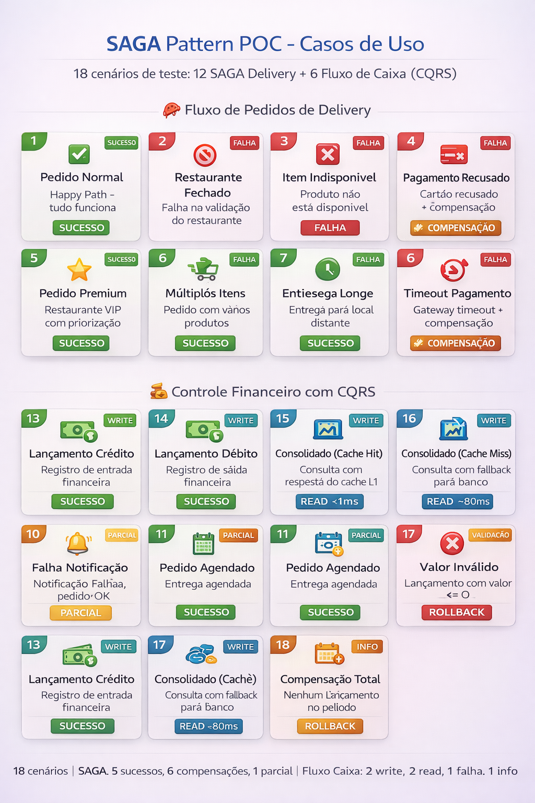

# POC SAGA Pattern + CQRS com Rebus e RabbitMQ


**Proof of Concept educacional** demonstrando:
- **SAGA Orquestrado** para Delivery com compensações em cascata
- **CQRS + Event-Driven** para Fluxo de Caixa com cache em 3 camadas

Utilizando **Rebus** e **RabbitMQ** para comunicação entre microsserviços, com **Result Pattern** para tratamento estruturado de erros.

---
## Por que esse repositório existe

Esse código **não nasceu para ser usado em produção**.

Ele nasceu porque explicar Sagas apenas em texto não estava sendo suficiente.
Sempre que o assunto surgia, a conversa escorregava para mensageria, tooling ou framework.
E o problema real ficava de fora.

Essa PoC existe para tornar visível uma dor comum em sistemas distribuídos:

> o fluxo funciona, mas o significado não está claro.

---

## O problema que este código tenta expor

Sagas coordenam execução.
Elas **não garantem entendimento**.

Na prática, a dificuldade raramente está em:

* publicar eventos
* reagir a mensagens
* implementar compensações

Ela aparece quando:

* contratos são implícitos
* versionamento vira formalidade
* o domínio é interpretado de formas diferentes por serviços distintos

Esse repositório usa Saga como instrumento didático para **provocar essa discussão**, não para encerrá‑la.

---

## O que você vai encontrar aqui

* Um fluxo distribuído modelado com Saga
* Comunicação assíncrona usando mensageria
* Compensações explícitas para falhas intermediárias
* Código organizado para leitura e análise — não otimizado para produção

Tudo funciona.
E isso é parte do problema.

---

## O que você **não** vai encontrar

* Arquitetura de referência
* Best practices universais
* Respostas fechadas
* Promessa de escalabilidade infinita

Existem decisões aqui que são **intencionalmente discutíveis**.
Elas fazem parte do aprendizado.

---

## Limitações Conhecidas

Este código possui limitações intencionais e não intencionais:

- **Sem testes automatizados**: A POC não possui cobertura de testes unitários ou de integração
- **Estado em memória**: SAGAs perdem estado ao reiniciar (InMemory storage)
- **Sem autenticação**: APIs expostas sem segurança
- **Sem outbox pattern**: Mensagens podem ser perdidas se o RabbitMQ cair após commit do banco
- **Métricas não validadas**: Os NFRs (50 req/s, P95 < 10ms) não foram testados com carga real
- **Acoplamento temporal**: Handlers dependem de ordem de mensagens
- **Sem reconciliação**: Não há mecanismo para corrigir dessincronização entre Write e Read Model

---

## Sobre contratos e versionamento

Mensagens aqui são versionadas.
Eventos têm nomes claros.

Ainda assim, o código não responde perguntas como:

* esse evento é contrato ou coincidência?
* quem decide o significado de um campo?
* quando uma mudança quebra entendimento, mesmo sem quebrar execução?

Essas perguntas não são resolvidas por tooling.

---

## Como usar este repositório

* Leia o código como quem lê uma decisão
* Questione os limites do fluxo
* Observe onde o domínio começa a ficar nebuloso

Se você discordar de algo aqui, o objetivo foi cumprido.

---

## Sobre o Projeto

### Domínio
Sistema de **Delivery de Comida** simulando um fluxo completo de processamento de pedidos.

### Objetivo
Demonstrar como implementar:
- **SAGA Orquestrado** com Rebus Sagas
- **Compensações explícitas** em caso de falha
- **Result Pattern** para tratamento de erros sem exceções
- **Mensageria assíncrona** com RabbitMQ
- **Idempotência** nas operações de compensação
- **Stack 100% Open Source** - Sem dependências de cloud

---

## Arquitetura

### Fluxo da SAGA



### Compensações em Cascata

Quando ocorre uma falha em qualquer etapa, as compensações são executadas **em ordem reversa**:


---

## Estrutura do Projeto

Ver diagrama completo em **[arquitetura.md](arquitetura.md)**.

---

## Como Executar

### Pré-requisitos

- **.NET 9 SDK** ou superior ([Download](https://dotnet.microsoft.com/download/dotnet/9.0))
- **Docker Desktop** ([Download](https://www.docker.com/products/docker-desktop))
- **Git**

### 1. Clonar o Repositório

```bash
git clone https://github.com/seu-usuario/saga-poc-dotnet.git
cd saga-poc-dotnet
```

### 2. Executar com Docker Compose (Recomendado)

Na pasta `docker/`, execute:

```bash
cd docker
docker-compose up -d
```

Isso irá iniciar toda a stack:
- **RabbitMQ 3.13** (Message Broker) - porta 5672 (AMQP) e 15672 (Management UI)
- **PostgreSQL 16** (3 instâncias) - portas 5432, 5433, 5434
- **Redis 7** (Cache distribuído) - porta 6379
- **SEQ** (Logs Estruturados) - porta 5341 (UI)
- **Jaeger** (Distributed Tracing) - porta 16686 (UI)
- **9 serviços .NET**:
  - SAGA: API (5000) + Orquestrador + 4 Workers
  - Fluxo de Caixa: API (5100) + Lançamentos + Consolidado

**OU** executar apenas o RabbitMQ (para rodar os serviços .NET manualmente):

```bash
cd docker
docker-compose up -d rabbitmq
```

### 3. Acessar as Interfaces Web

Após executar o `docker-compose up -d`, acesse:

#### RabbitMQ Management UI
```
http://localhost:15672
```
**Credenciais:** `saga` / `saga123`

Monitore:
- **Queues** (filas de mensagens)
- **Exchanges** (roteadores de mensagens)
- **Connections** (conexões ativas)
- **Channels** (canais de comunicação)

#### Jaeger UI (Distributed Tracing)
```
http://localhost:16686
```
Visualize traces distribuídos das SAGAs end-to-end:
- Selecione o serviço (ex: `SagaPoc.Api`)
- Veja a propagação através de todos os serviços
- Analise latências e bottlenecks

#### SEQ (Logs Estruturados)
```
http://localhost:5341
```
**Credenciais:** `admin` / `admin123`

Visualize logs estruturados em tempo real:
- Filtros poderosos com sintaxe SQL-like
- Queries por properties (ex: `Application = "SagaPoc.Orquestrador"`)
- Acompanhe eventos de domínio, comandos e sagas
- Correlação por CorrelationId

#### API Swagger
```
http://localhost:5000
```
Documentação interativa da API REST

### 4. Executar os Serviços

> **Nota**: Se você executou `docker-compose up -d` no passo 2, os serviços já estão rodando! Pule para a seção de testes.

#### Opção 1: Via Docker Compose (Recomendado - Já configurado)

```bash
cd docker
docker-compose up -d
```

#### Opção 2: Manualmente (9 terminais - Para desenvolvimento local)

**SAGA Delivery (6 serviços):**
```bash
# Terminal 1: API SAGA
cd src/SagaPoc.Api
dotnet run

# Terminal 2: Orquestrador
cd src/SagaPoc.Orquestrador
dotnet run

# Terminal 3: Serviço Restaurante
cd src/SagaPoc.ServicoRestaurante
dotnet run

# Terminal 4: Serviço Pagamento
cd src/SagaPoc.ServicoPagamento
dotnet run

# Terminal 5: Serviço Entregador
cd src/SagaPoc.ServicoEntregador
dotnet run

# Terminal 6: Serviço Notificação
cd src/SagaPoc.ServicoNotificacao
dotnet run
```

**Fluxo de Caixa - CQRS (3 serviços):**
```bash
# Terminal 7: API Fluxo de Caixa
cd src/SagaPoc.ServicoFluxoCaixa/SagaPoc.FluxoCaixa.Api
dotnet run

# Terminal 8: Lançamentos (Write Model)
cd src/SagaPoc.ServicoFluxoCaixa/SagaPoc.FluxoCaixa.Lancamentos
dotnet run

# Terminal 9: Consolidado (Read Model)
cd src/SagaPoc.ServicoFluxoCaixa/SagaPoc.FluxoCaixa.Consolidado
dotnet run
```

### 5. Acessar as APIs

**SAGA Delivery:**
- **Swagger UI**: http://localhost:5000/swagger
- **Health Check**: http://localhost:5000/health

**Fluxo de Caixa (CQRS):**
- **Swagger UI**: http://localhost:5100/swagger
- **Health Check**: http://localhost:5100/health

### 6. Monitorar as Filas no RabbitMQ

Acesse o **RabbitMQ Management UI** em http://localhost:15672 e clique na aba **Queues**.

Você verá as seguintes filas sendo criadas automaticamente pelo Rebus:

**SAGA Delivery:**
- **`fila-orquestrador`** - Mensagens para a SAGA (Orquestrador)
- **`fila-restaurante`** - Mensagens para validação de pedidos no restaurante
- **`fila-pagamento`** - Mensagens para processamento de pagamentos
- **`fila-entregador`** - Mensagens para alocação de entregadores
- **`fila-notificacao`** - Mensagens para notificações aos clientes

**Fluxo de Caixa (CQRS):**
- **`fila-lancamentos`** - Comandos de registro de lançamentos (Write Model)
- **`fila-consolidado`** - Eventos para atualização do consolidado (Read Model)

**Comum:**
- **`fila-error`** - Mensagens que falharam após todas as tentativas de retry (Dead Letter Queue)

Ao fazer requisições à API, você poderá ver em tempo real:
- **Ready**: Mensagens aguardando processamento
- **Unacked**: Mensagens sendo processadas no momento
- **Total**: Total de mensagens que passaram pela fila

### 7. Parar os Serviços

#### Parar toda a stack Docker
```bash
cd docker
docker-compose down
```

#### Parar e limpar volumes (remove dados persistidos)
```bash
cd docker
docker-compose down -v
```

#### Parar apenas serviços .NET (se rodando manualmente)
Pressione `Ctrl+C` em cada terminal.

---

## Testando os Casos de Uso

### 18 Cenários Implementados

O projeto possui **18 cenários de teste** divididos em dois contextos:

| Contexto | Cenários | Descrição |
|----------|----------|-----------|
| **SAGA Delivery** | 1-12 | Pedidos, falhas, compensações |
| **Fluxo de Caixa** | 13-18 | Lançamentos, consolidado, cache |



---

### Via Scripts Automatizados

#### Windows (PowerShell):
```powershell
cd docs/scripts
.\testar-casos-de-uso.ps1        # Testa todos os 18 casos
.\testar-casos-de-uso.ps1 5      # Testa apenas o caso 5 (SAGA)
.\testar-casos-de-uso.ps1 15     # Testa apenas o caso 15 (Fluxo de Caixa)
```

#### Linux/Mac (Bash):
```bash
cd docs/scripts
./testar-casos-de-uso.sh         # Testa todos os 18 casos
./testar-casos-de-uso.sh 5       # Testa apenas o caso 5 (SAGA)
./testar-casos-de-uso.sh 15      # Testa apenas o caso 15 (Fluxo de Caixa)
```

### Via curl (Exemplo: Caso 1 - Pedido Normal)

```bash
curl -X POST http://localhost:5000/api/pedidos \
  -H "Content-Type: application/json" \
  -d '{
    "clienteId": "CLI001",
    "restauranteId": "REST001",
    "itens": [
      {
        "produtoId": "PROD001",
        "nome": "Pizza Margherita",
        "quantidade": 1,
        "precoUnitario": 45.90
      }
    ],
    "enderecoEntrega": "Rua das Flores, 123",
    "formaPagamento": "CREDITO"
  }'
```

**Resposta esperada**:
```json
{
  "pedidoId": "a1b2c3d4-e5f6-7890-abcd-ef1234567890",
  "mensagem": "Pedido recebido e está sendo processado.",
  "status": "Pendente"
}
```

### Via curl (Exemplo: Caso 13 - Lançamento Crédito)

```bash
curl -X POST http://localhost:5100/api/lancamentos \
  -H "Content-Type: application/json" \
  -d '{
    "tipo": "Credito",
    "valor": 150.00,
    "descricao": "Venda de produto",
    "comerciante": "COM001",
    "categoria": "Vendas"
  }'
```

**Resposta esperada**:
```json
{
  "id": "b2c3d4e5-f6a7-8901-bcde-f23456789012",
  "mensagem": "Lançamento registrado com sucesso.",
  "status": "Pendente"
}
```

### Via curl (Exemplo: Caso 15 - Consultar Consolidado)

```bash
curl -X GET "http://localhost:5100/api/consolidado?comerciante=COM001&data=2026-01-17"
```

**Resposta esperada**:
```json
{
  "comerciante": "COM001",
  "data": "2026-01-17",
  "totalCreditos": 150.00,
  "totalDebitos": 0.00,
  "saldoDiario": 150.00,
  "quantidadeCreditos": 1,
  "quantidadeDebitos": 0,
  "cacheHit": true
}
```

### Observando os Logs

Cada serviço gera logs estruturados com Serilog. Exemplo de fluxo completo:

```
[INFO] Validando pedido no restaurante REST001 com 1 itens
[INFO] Pedido validado. ValorTotal: R$ 45,90, TempoPreparo: 10min
[INFO] Processando pagamento. ClienteId: CLI001, Valor: R$ 45,90
[INFO] Pagamento aprovado. TransacaoId: TXN_abc123
[INFO] Alocando entregador. RestauranteId: REST001
[INFO] Entregador ENT001 alocado. TempoEstimado: 25min
[INFO] Notificação enviada com sucesso. Tipo: PedidoConfirmado
[INFO] SAGA finalizada com sucesso. Estado: PedidoConfirmado
```

---

## Documentação Completa

### Documentos Principais

- **[casos-uso.md](casos-uso.md)** - Detalhamento completo dos 12 cenários com payloads
- **[plano-execucao.md](plano-execucao/plano-execucao.md)** - Plano de execução do projeto
- **[arquitetura.md](arquitetura.md)** - Detalhes da arquitetura e decisões técnicas

### Documentação Operacional (Fase 14)

- **[diagramas-compensacao.md](diagramas-compensacao.md)** - Diagramas detalhados dos fluxos de compensação e estados da SAGA
- **[runbook-troubleshooting.md](runbook-troubleshooting.md)** - Guia de diagnóstico e resolução de problemas comuns
- **[boas-praticas.md](boas-praticas.md)** - Guia de boas práticas para implementação e operação de SAGAs

### Scripts de Teste

- **[docs/scripts/readme-script.md](scripts/readme-script.md)** - Como usar os scripts de teste

### Documentação por Contexto

Este repositório implementa dois contextos principais:

#### 1. SAGA Pattern com Delivery de Comida

Demonstração educacional do padrão SAGA Orquestrado para sistemas distribuídos.

**Objetivo**: Mostrar implementação de SAGA com compensações e resiliência.

**Documentação**:
- [Arquitetura SAGA](arquitetura.md) - Detalhes técnicos da implementação
- [Casos de Uso](casos-uso.md) - 12 cenários implementados
- [Diagramas de Compensação](diagramas-compensacao.md) - Fluxos visuais
- [Boas Práticas](boas-praticas.md) - Os 10 mandamentos da SAGA
- [Runbook Troubleshooting](runbook-troubleshooting.md) - Guia operacional

**Serviços**: API, Orquestrador, Restaurante, Pagamento, Entregador, Notificação

#### 2. Fluxo de Caixa (CQRS + Event-Driven)

Sistema de controle de lançamentos com consolidado diário, demonstrando CQRS e arquitetura orientada a eventos.

**Objetivo**: Implementar sistema de alta performance com separação de responsabilidades.

**Documentação**:
- **[Fluxo de Caixa](fluxo-caixa.md)** - Documentação completa do contexto
- **[Diagramas Mermaid](diagramas-fluxo-caixa.md)** - Diagramas de arquitetura
- **[ADRs](decisoes-tecnicas/)** - Decisões arquiteturais documentadas

**Características**:
- CQRS: Write Model (Lançamentos) e Read Model (Consolidado)
- Cache em 3 camadas (Memory + Redis + HTTP Response)
- Event-Driven: Sincronização assíncrona via RabbitMQ
- Observabilidade: Serilog + SEQ + Jaeger (OpenTelemetry)

**Serviços**: API, Lançamentos, Consolidado

**Nota**: Os NFRs (50 req/s, latência P95) são objetivos, não foram validados com testes de carga.

---

## Tecnologias Utilizadas

  

---

## Conceitos Demonstrados

### 1. SAGA Orquestrado
- Saga centralizada com Rebus
- Controle de fluxo via Message Handlers
- Persistência do estado (InMemory para POC)
- Veja **[Diagramas de Compensação](diagramas-compensacao.md)** para detalhes visuais

### 2. Compensações Explícitas
- Rollback em ordem reversa
- Compensações implementadas manualmente nos handlers
- Idempotência (executar 2x não causa problema)
- Tratamento de erros estruturado
- Consulte **[Boas Práticas](boas-praticas.md)** para implementação correta

### 3. Result Pattern
- Encapsulamento de sucesso/falha
- Sem exceções para controle de fluxo
- Propagação de erros estruturados

### 4. Mensageria Assíncrona
- Request/Response via Rebus (Send/Reply)
- Roteamento baseado em tipos
- Dead Letter Queue automática

---

## Observabilidade

A POC inclui observabilidade com **Serilog + SEQ** (logs) e **Jaeger** (tracing).

| Ferramenta | URL | Credenciais |
|------------|-----|-------------|
| SEQ | http://localhost:5341 | admin/admin123 |
| Jaeger | http://localhost:16686 | - |
| RabbitMQ | http://localhost:15672 | saga/saga123 |

Ver detalhes em **[arquitetura.md](arquitetura.md#observabilidade)**.

Para problemas comuns, consulte o **[Runbook de Troubleshooting](runbook-troubleshooting.md)**.

---

## Próximos Passos (Para Produção)

Esta POC é **educacional**. Para produção, considere:

### 1. Persistência da SAGA
- Trocar `InMemoryRepository` por **Postgres**
- Garantir recuperação em caso de reinicialização

### 2. Outbox Pattern
- Garantir atomicidade entre banco de dados e mensagens
- Evitar perda de mensagens

### 3. Retry Policy e Circuit Breaker
- Configurar retry exponencial
- Proteger serviços downstream

### 4. Idempotência
- Deduplicação de mensagens por MessageId
- Armazenamento em Redis/SQL

### 5. Observabilidade **Implementado (Fase 12)**
- Serilog + SEQ (Logs Estruturados)
- OpenTelemetry + Jaeger (Distributed Tracing)
- ⏳ Application Insights (Azure - opcional)

### 6. Testes
- Testes de integração automatizados
- Testes de carga (NBomber)
- Chaos Engineering

---

## Licença

Este projeto é licenciado sob a [MIT License](LICENSE).

---

## Contribuindo

Contribuições são bem-vindas! Sinta-se à vontade para:
- Reportar bugs
- Sugerir melhorias
- Adicionar novos casos de uso
- Melhorar a documentação

---

## Contato

Criado como material educacional sobre padrões de microsserviços.

---

## Agradecimentos

- [Rebus](https://github.com/rebus-org/Rebus) - Framework de mensageria simples e poderoso
- [RabbitMQ](https://www.rabbitmq.com/) - Message broker open source confiável e battle-tested
- [Chris Richardson](https://microservices.io/patterns/data/saga.html) - Padrão SAGA
- [Docker](https://www.docker.com/) - Containerização e simplificação de deploy

**Última atualização**: 2026-01-17 - Fluxo de Caixa (CQRS) integrado com 18 cenários de teste