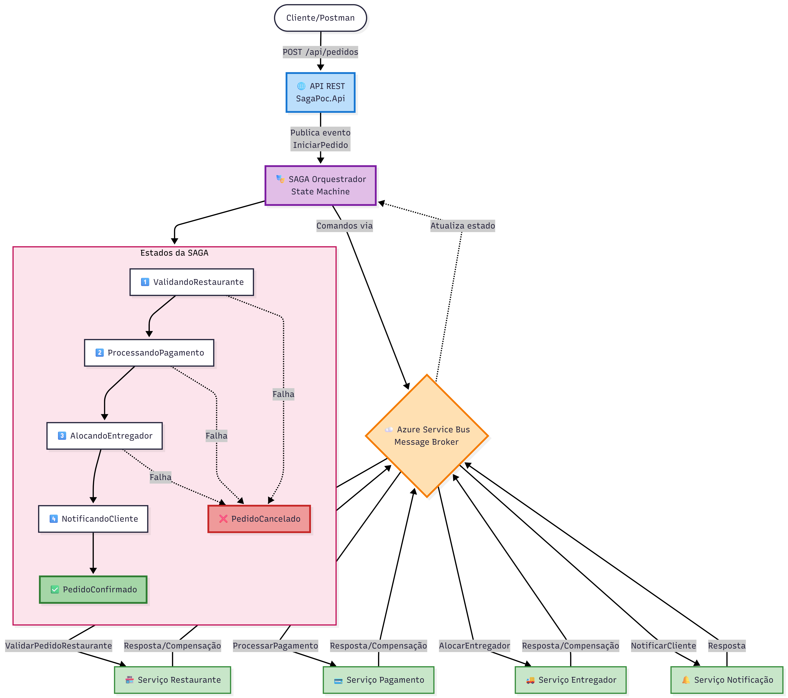
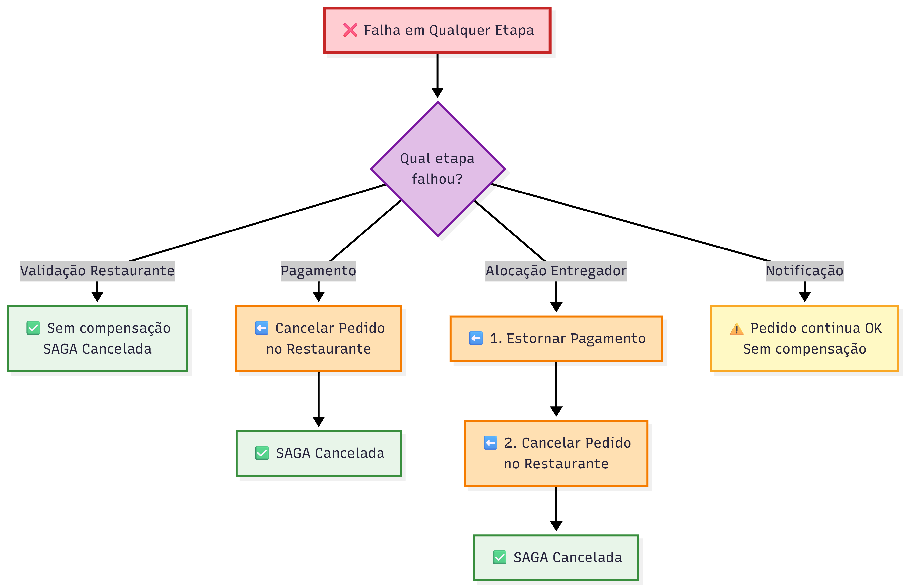
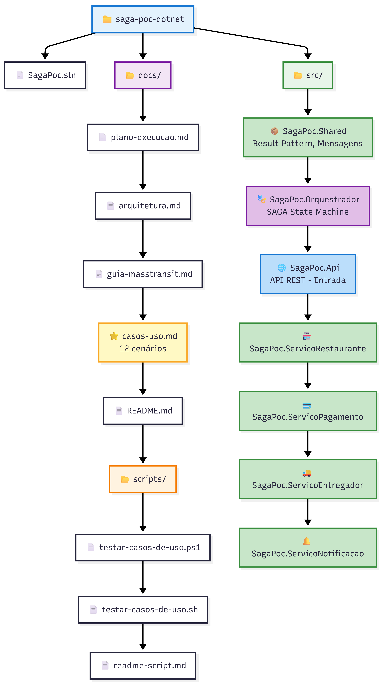
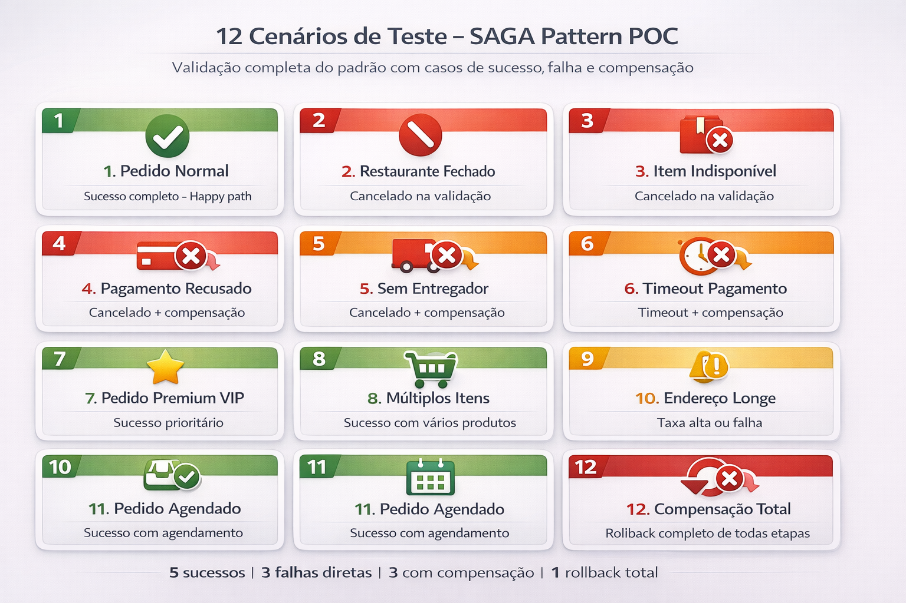
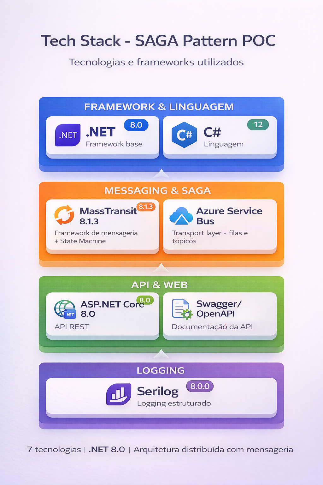

# POC SAGA Pattern com Rebus e RabbitMQ


**Proof of Concept** demonstrando a implementação do **padrão SAGA Orquestrado** utilizando **Rebus** e **RabbitMQ** para comunicação entre microsserviços, com aplicação do **Result Pattern** para tratamento estruturado de erros.

---

## Sobre o Projeto

### Domínio
Sistema de **Delivery de Comida** simulando um fluxo completo de processamento de pedidos.

### Objetivo
Demonstrar como implementar:
- **SAGA Orquestrado** com Rebus Sagas
- **Compensações explícitas** em caso de falha
- **Result Pattern** para tratamento de erros sem exceções
- **Mensageria assíncrona** com RabbitMQ
- **Idempotência** nas operações de compensação
- **Stack 100% Open Source** - Sem dependências de cloud

---

## Arquitetura

### Fluxo da SAGA



### Compensações em Cascata

Quando ocorre uma falha em qualquer etapa, as compensações são executadas **em ordem reversa**:


---

## Estrutura do Projeto


---

## Como Executar

### Pré-requisitos

- **.NET 9 SDK** ou superior ([Download](https://dotnet.microsoft.com/download/dotnet/9.0))
- **Docker Desktop** ([Download](https://www.docker.com/products/docker-desktop))
- **Git**

### 1. Clonar o Repositório

```bash
git clone https://github.com/seu-usuario/saga-poc-dotnet.git
cd saga-poc-dotnet
```

### 2. Executar com Docker Compose (Recomendado)

Na pasta `docker/`, execute:

```bash
cd docker
docker-compose up -d
```

Isso irá iniciar toda a stack:
- **RabbitMQ 3.13** (Message Broker) - porta 5672 (AMQP) e 15672 (Management UI)
- **Jaeger** (Distributed Tracing) - porta 16686 (UI)
- **Prometheus** (Métricas) - porta 9090
- **Grafana** (Dashboards) - porta 3000
- **Node Exporter** (Métricas do sistema) - porta 9100
- **Todos os 6 serviços .NET** (API + Orquestrador + 4 Workers)

**OU** executar apenas o RabbitMQ (para rodar os serviços .NET manualmente):

```bash
cd docker
docker-compose up -d rabbitmq
```

### 3. Acessar as Interfaces Web

Após executar o `docker-compose up -d`, acesse:

#### RabbitMQ Management UI
```
http://localhost:15672
```
**Credenciais:** `saga` / `saga123`

Monitore:
- **Queues** (filas de mensagens)
- **Exchanges** (roteadores de mensagens)
- **Connections** (conexões ativas)
- **Channels** (canais de comunicação)

#### Jaeger UI (Distributed Tracing)
```
http://localhost:16686
```
Visualize traces distribuídos das SAGAs end-to-end:
- Selecione o serviço (ex: `SagaPoc.Api`)
- Veja a propagação através de todos os serviços
- Analise latências e bottlenecks

#### Prometheus (Métricas)
```
http://localhost:9090
```
Execute queries de métricas:
- `rate(http_server_requests_total[5m])` - Taxa de requisições
- `histogram_quantile(0.95, rate(http_server_request_duration_seconds_bucket[5m]))` - P95 latência

#### Grafana (Dashboards)
```
http://localhost:3000
```
**Credenciais:** `admin` / `admin123`

Datasources já configurados:
- **Prometheus** (métricas)
- **Jaeger** (traces)

#### API Swagger
```
http://localhost:5000
```
Documentação interativa da API REST

### 4. Executar os Serviços

> **Nota**: Se você executou `docker-compose up -d` no passo 2, os serviços já estão rodando! Pule para a seção de testes.

#### Opção 1: Via Docker Compose (Recomendado - Já configurado)

```bash
cd docker
docker-compose up -d
```

#### Opção 2: Manualmente (6 terminais - Para desenvolvimento local)

```bash
# Terminal 1: API
cd src/SagaPoc.Api
dotnet run

# Terminal 2: Orquestrador
cd src/SagaPoc.Orquestrador
dotnet run

# Terminal 3: Serviço Restaurante
cd src/SagaPoc.ServicoRestaurante
dotnet run

# Terminal 4: Serviço Pagamento
cd src/SagaPoc.ServicoPagamento
dotnet run

# Terminal 5: Serviço Entregador
cd src/SagaPoc.ServicoEntregador
dotnet run

# Terminal 6: Serviço Notificação
cd src/SagaPoc.ServicoNotificacao
dotnet run
```

### 5. Acessar a API

- **Swagger UI**: http://localhost:5000 ou http://localhost:5000/swagger
- **Health Check**: http://localhost:5000/health

### 6. Monitorar as Filas no RabbitMQ

Acesse o **RabbitMQ Management UI** em http://localhost:15672 e clique na aba **Queues**.

Você verá as seguintes filas sendo criadas automaticamente pelo Rebus:

- **`fila-orquestrador`** - Mensagens para a SAGA (Orquestrador)
- **`fila-restaurante`** - Mensagens para validação de pedidos no restaurante
- **`fila-pagamento`** - Mensagens para processamento de pagamentos
- **`fila-entregador`** - Mensagens para alocação de entregadores
- **`fila-notificacao`** - Mensagens para notificações aos clientes
- **`fila-error`** - Mensagens que falharam após todas as tentativas de retry (Dead Letter Queue)

Ao fazer requisições à API, você poderá ver em tempo real:
- **Ready**: Mensagens aguardando processamento
- **Unacked**: Mensagens sendo processadas no momento
- **Total**: Total de mensagens que passaram pela fila

### 7. Parar os Serviços

#### Parar toda a stack Docker
```bash
cd docker
docker-compose down
```

#### Parar e limpar volumes (remove dados persistidos)
```bash
cd docker
docker-compose down -v
```

#### Parar apenas serviços .NET (se rodando manualmente)
Pressione `Ctrl+C` em cada terminal.

---

## Testando os Casos de Uso

### 12 Cenários Implementados


---

### Via Scripts Automatizados

#### Windows (PowerShell):
```powershell
cd docs/scripts
.\testar-casos-de-uso.ps1        # Testa todos os 12 casos
.\testar-casos-de-uso.ps1 5      # Testa apenas o caso 5
```

#### Linux/Mac (Bash):
```bash
cd docs/scripts
./testar-casos-de-uso.sh         # Testa todos os 12 casos
./testar-casos-de-uso.sh 5       # Testa apenas o caso 5
```

### Via curl (Exemplo: Caso 1 - Pedido Normal)

```bash
curl -X POST http://localhost:5000/api/pedidos \
  -H "Content-Type: application/json" \
  -d '{
    "clienteId": "CLI001",
    "restauranteId": "REST001",
    "itens": [
      {
        "produtoId": "PROD001",
        "nome": "Pizza Margherita",
        "quantidade": 1,
        "precoUnitario": 45.90
      }
    ],
    "enderecoEntrega": "Rua das Flores, 123",
    "formaPagamento": "CREDITO"
  }'
```

**Resposta esperada**:
```json
{
  "pedidoId": "a1b2c3d4-e5f6-7890-abcd-ef1234567890",
  "mensagem": "Pedido recebido e está sendo processado.",
  "status": "Pendente"
}
```

### Observando os Logs

Cada serviço gera logs estruturados com Serilog. Exemplo de fluxo completo:

```
[INFO] Validando pedido no restaurante REST001 com 1 itens
[INFO] Pedido validado. ValorTotal: R$ 45,90, TempoPreparo: 10min
[INFO] Processando pagamento. ClienteId: CLI001, Valor: R$ 45,90
[INFO] Pagamento aprovado. TransacaoId: TXN_abc123
[INFO] Alocando entregador. RestauranteId: REST001
[INFO] Entregador ENT001 alocado. TempoEstimado: 25min
[INFO] Notificação enviada com sucesso. Tipo: PedidoConfirmado
[INFO] SAGA finalizada com sucesso. Estado: PedidoConfirmado
```

---

## Documentação Completa

### Documentos Principais

- **[casos-uso.md](casos-uso.md)** - Detalhamento completo dos 12 cenários com payloads
- **[PLANO-EXECUCAO.md](PLANO-EXECUCAO.md)** - Plano de execução do projeto
- **[arquitetura.md](arquitetura.md)** - Detalhes da arquitetura e decisões técnicas
- **[guia-rebus.md](guia-rebus.md)** - Guia de uso do Rebus
- **[MIGRACAO-MASSTRANSIT-PARA-REBUS.md](MIGRACAO-MASSTRANSIT-PARA-REBUS.md)** - Documento da migração de MassTransit para Rebus

### Documentação Operacional (Fase 14)

- **[diagramas-compensacao.md](diagramas-compensacao.md)** - Diagramas detalhados dos fluxos de compensação e estados da SAGA
- **[runbook-troubleshooting.md](runbook-troubleshooting.md)** - Guia de diagnóstico e resolução de problemas comuns
- **[boas-praticas.md](boas-praticas.md)** - Guia de boas práticas para implementação e operação de SAGAs

### Scripts de Teste

- **[docs/scripts/readme-script.md](scripts/readme-script.md)** - Como usar os scripts de teste

---

## Tecnologias Utilizadas

  

---

## Conceitos Demonstrados

### 1. SAGA Orquestrado
- Saga centralizada com Rebus
- Controle de fluxo via Message Handlers
- Persistência do estado (InMemory para POC)
- Veja **[Diagramas de Compensação](diagramas-compensacao.md)** para detalhes visuais

### 2. Compensações Explícitas
- Rollback em ordem reversa
- Compensações implementadas manualmente nos handlers
- Idempotência (executar 2x não causa problema)
- Tratamento de erros estruturado
- Consulte **[Boas Práticas](boas-praticas.md)** para implementação correta

### 3. Result Pattern
- Encapsulamento de sucesso/falha
- Sem exceções para controle de fluxo
- Propagação de erros estruturados

### 4. Mensageria Assíncrona
- Request/Response via Rebus (Send/Reply)
- Roteamento baseado em tipos
- Dead Letter Queue automática

### Aprenda Mais

Para entender como implementar corretamente cada conceito, consulte:
- **[Boas Práticas](boas-praticas.md)** - Os 10 mandamentos da SAGA, com exemplos de código
- **[Diagramas de Compensação](diagramas-compensacao.md)** - Visualização completa dos fluxos

---

## Observabilidade

### Stack Completa Implementada (Fase 12)

A POC inclui observabilidade completa com **OpenTelemetry**, **Jaeger**, **Prometheus** e **Grafana**.

#### 1. **Logs Estruturados (Serilog)**

Cada operação gera logs com:
- **CorrelationId** (rastreamento end-to-end)
- **Transições de estado** da SAGA
- **Compensações executadas**
- **Timestamps** e métricas

```bash
# Filtrar logs por PedidoId
grep "a1b2c3d4-e5f6-7890-abcd-ef1234567890" logs/*.log
```

#### 2. **Distributed Tracing (Jaeger + OpenTelemetry)**

- **URL**: http://localhost:16686
- Rastreamento end-to-end de todas as requisições
- Propagação de contexto através do RabbitMQ
- Visualização de latências por serviço
- Spans customizados para operações críticas

**Exemplo de uso:**
1. Acesse o Jaeger UI
2. Selecione o serviço `SagaPoc.Api`
3. Visualize o trace completo da SAGA
4. Identifique bottlenecks e falhas

#### 3. **Métricas (Prometheus)**

- **URL**: http://localhost:9090
- Coleta automática de métricas dos serviços .NET
- Endpoint `/metrics` exposto em cada serviço
- Métricas de HTTP, runtime e custom

**Queries úteis:**
```promql
# Taxa de requisições por segundo
rate(http_server_requests_total[5m])

# Duração P95 das requisições
histogram_quantile(0.95, rate(http_server_request_duration_seconds_bucket[5m]))

# Taxa de erro (status 5xx)
rate(http_server_requests_total{status=~"5.."}[5m])
```

#### 4. **Dashboards (Grafana)**

- **URL**: http://localhost:3000 (admin/admin123)
- Datasources pré-configurados (Prometheus + Jaeger)
- Crie dashboards personalizados para:
  - Taxa de sucesso/falha de SAGAs
  - Duração média das compensações
  - Throughput do RabbitMQ
  - Latência por serviço

#### 5. **Métricas do Sistema (Node Exporter)**

- **URL**: http://localhost:9100/metrics
- CPU, memória, disco e rede do host
- Integrado ao Prometheus

### Instrumentação Implementada

Todos os serviços incluem:
- ✅ **AspNetCore Instrumentation** - Traces HTTP automáticos
- ✅ **HttpClient Instrumentation** - Traces de chamadas externas
- ✅ **EntityFramework Instrumentation** - Traces de queries SQL
- ✅ **Rebus Integration** - Propagação de contexto via mensageria
- ✅ **Custom Spans** - Para operações de negócio críticas

### Troubleshooting

Para diagnosticar e resolver problemas comuns, consulte o **[Runbook de Troubleshooting](runbook-troubleshooting.md)** que cobre:
- SAGA travada
- Mensagens em Dead Letter Queue
- Compensação falhou
- Alta latência nas SAGAs
- Circuit breaker aberto
- Perda de mensagens
- Duplicação de pedidos

E muitos outros cenários com diagnóstico passo a passo e ações corretivas.

---

## Próximos Passos (Para Produção)

Esta POC é **educacional**. Para produção, considere:

### 1. Persistência da SAGA
- Trocar `InMemoryRepository` por **SQL Server** ou **Redis**
- Garantir recuperação em caso de reinicialização

### 2. Outbox Pattern
- Garantir atomicidade entre banco de dados e mensagens
- Evitar perda de mensagens

### 3. Retry Policy e Circuit Breaker
- Configurar retry exponencial
- Proteger serviços downstream

### 4. Idempotência
- Deduplicação de mensagens por MessageId
- Armazenamento em Redis/SQL

### 5. Observabilidade ✅ **Implementado (Fase 12)**
- ✅ OpenTelemetry + Jaeger (Distributed Tracing)
- ✅ Prometheus (Métricas)
- ✅ Grafana (Dashboards)
- ⏳ Application Insights (Azure - opcional)

### 6. Testes
- Testes de integração automatizados
- Testes de carga (NBomber)
- Chaos Engineering

Veja mais detalhes em [plano-execucao.md - Seção 9](plano-execucao.md).

---

## Licença

Este projeto é licenciado sob a [MIT License](LICENSE).

---

## Contribuindo

Contribuições são bem-vindas! Sinta-se à vontade para:
- Reportar bugs
- Sugerir melhorias
- Adicionar novos casos de uso
- Melhorar a documentação

---

## Contato

Criado como material educacional sobre padrões de microsserviços.

---

## Agradecimentos

- [Rebus](https://github.com/rebus-org/Rebus) - Framework de mensageria simples e poderoso
- [RabbitMQ](https://www.rabbitmq.com/) - Message broker open source confiável e battle-tested
- [Chris Richardson](https://microservices.io/patterns/data/saga.html) - Padrão SAGA
- [Docker](https://www.docker.com/) - Containerização e simplificação de deploy

**Última atualização**: 2026-01-08 - Migração de MassTransit para Rebus concluída