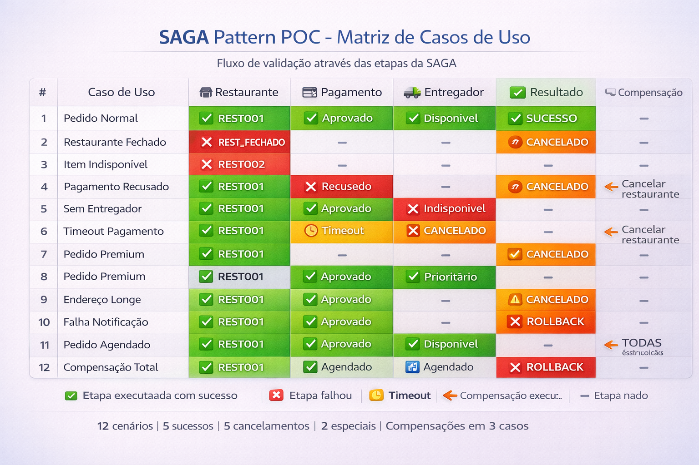

# Casos de Uso - POC SAGA Pattern

Este documento detalha os **12 casos de uso** implementados na POC, com cenários de **sucesso**, **falha** e **compensação**.

---

## Tabela de Resumo



---

## Detalhamento dos Casos de Uso

### **Caso 1: Pedido Normal (Happy Path)**

**Descrição**: Pedido processado com sucesso em todas as etapas.

**Fluxo**:
1. Restaurante valida o pedido
2. Pagamento aprovado
3. Entregador alocado
4. Cliente notificado

**Payload**:
```json
{
  "clienteId": "CLI001",
  "restauranteId": "REST001",
  "itens": [
    {
      "produtoId": "PROD001",
      "nome": "Pizza Margherita",
      "quantidade": 1,
      "precoUnitario": 45.90
    }
  ],
  "enderecoEntrega": "Rua das Flores, 123 - Centro",
  "formaPagamento": "CREDITO"
}
```

**Resposta Esperada**:
```json
{
  "pedidoId": "a1b2c3d4-e5f6-7890-abcd-ef1234567890",
  "mensagem": "Pedido recebido e está sendo processado.",
  "status": "Pendente"
}
```

**Logs Esperados**:
```
[INFO] Validando pedido no restaurante REST001 com 1 itens
[INFO] Pedido validado com sucesso. ValorTotal: R$ 45,90, TempoPreparo: 10min
[INFO] Processando pagamento. ClienteId: CLI001, Valor: R$ 45,90
[INFO] Pagamento aprovado. TransacaoId: TXN_abc123
[INFO] Alocando entregador. RestauranteId: REST001
[INFO] Entregador alocado. EntregadorId: ENT001, TempoEstimado: 25min
[INFO] Notificação enviada com sucesso. Tipo: PedidoConfirmado
```

---

### **Caso 2: Restaurante Fechado**

**Descrição**: Pedido rejeitado porque o restaurante está fechado.

**Fluxo**:
1. Restaurante rejeita (fechado)
2. Cliente notificado sobre cancelamento

**Payload**:
```json
{
  "clienteId": "CLI001",
  "restauranteId": "REST_FECHADO",
  "itens": [
    {
      "produtoId": "PROD001",
      "nome": "Hambúrguer Artesanal",
      "quantidade": 2,
      "precoUnitario": 28.50
    }
  ],
  "enderecoEntrega": "Av. Principal, 456",
  "formaPagamento": "DEBITO"
}
```

**Resposta Esperada**:
```json
{
  "pedidoId": "b2c3d4e5-f6a7-8901-bcde-f12345678901",
  "mensagem": "Pedido recebido e está sendo processado.",
  "status": "Pendente"
}
```

**Logs Esperados**:
```
[WARN] Restaurante REST_FECHADO está fechado
[INFO] Transição de estado: ValidandoRestaurante → PedidoCancelado
[INFO] Notificação enviada: "Pedido cancelado: Restaurante fechado no momento"
```

**Observação**: O pedido é rejeitado imediatamente, sem processar pagamento ou entregador.

---

### **Caso 3: Item Indisponível**

**Descrição**: Pedido rejeitado porque um ou mais itens não estão disponíveis.

**Fluxo**:
1. Restaurante rejeita (item indisponível)
2. Cliente notificado

**Payload**:
```json
{
  "clienteId": "CLI002",
  "restauranteId": "REST002",
  "itens": [
    {
      "produtoId": "INDISPONIVEL",
      "nome": "Produto Esgotado",
      "quantidade": 1,
      "precoUnitario": 35.00
    }
  ],
  "enderecoEntrega": "Rua das Palmeiras, 789",
  "formaPagamento": "PIX"
}
```

**Logs Esperados**:
```
[WARN] Item INDISPONIVEL indisponível no restaurante REST002
[INFO] Pedido cancelado: O item 'Produto Esgotado' não está disponível no momento
```

---

### **Caso 4: Pagamento Recusado**

**Descrição**: Restaurante aceita, mas pagamento é recusado pela operadora.

**Fluxo**:
1. Restaurante valida o pedido
2. Pagamento recusado
3. **COMPENSAÇÃO**: Cancelar pedido no restaurante
4. Cliente notificado

**Payload**:
```json
{
  "clienteId": "CLI_CARTAO_RECUSADO",
  "restauranteId": "REST001",
  "itens": [
    {
      "produtoId": "PROD003",
      "nome": "Sushi Combo",
      "quantidade": 1,
      "precoUnitario": 89.90
    }
  ],
  "enderecoEntrega": "Rua das Acácias, 321",
  "formaPagamento": "CREDITO"
}
```

**Logs Esperados**:
```
[INFO] Pedido validado com sucesso. ValorTotal: R$ 89,90
[WARN] Pagamento recusado. ClienteId: CLI_CARTAO_RECUSADO, Motivo: Cartão recusado
[WARN] COMPENSAÇÃO: Cancelando pedido no restaurante REST001
[INFO] Pedido cancelado com sucesso
[INFO] Notificação enviada: Pedido cancelado (pagamento recusado)
```

**Compensação Executada**: Cancelamento do pedido no restaurante

---

### **Caso 5: Sem Entregador Disponível**

**Descrição**: Restaurante e pagamento OK, mas não há entregadores disponíveis.

**Fluxo**:
1. Restaurante valida o pedido
2. Pagamento aprovado
3. Nenhum entregador disponível
4. **COMPENSAÇÃO**: Estornar pagamento
5. **COMPENSAÇÃO**: Cancelar pedido no restaurante
6. Cliente notificado

**Payload**:
```json
{
  "clienteId": "CLI003",
  "restauranteId": "REST001",
  "itens": [
    {
      "produtoId": "PROD004",
      "nome": "Salada Caesar",
      "quantidade": 3,
      "precoUnitario": 22.50
    }
  ],
  "enderecoEntrega": "Rua MUITO LONGE do centro, 9999",
  "formaPagamento": "CREDITO"
}
```

**Observação**: Usar endereço com palavras "LONGE" ou "DISTANTE" força a indisponibilidade de entregador.

**Logs Esperados**:
```
[INFO] Pedido validado com sucesso. ValorTotal: R$ 67,50
[INFO] Pagamento aprovado. TransacaoId: TXN_xyz789
[WARN] Nenhum entregador disponível para endereço distante
[WARN] COMPENSAÇÃO: Estornando pagamento. TransacaoId: TXN_xyz789
[INFO] Pagamento estornado com sucesso. Valor: R$ 67,50
[WARN] COMPENSAÇÃO: Cancelando pedido no restaurante
[INFO] Notificação enviada: Pedido cancelado (sem entregador disponível)
```

**Compensações Executadas**:
- Estorno do pagamento
- Cancelamento do pedido no restaurante

---

### **Caso 6: Timeout no Pagamento**

**Descrição**: Gateway de pagamento não responde (timeout).

**Fluxo**:
1. Restaurante valida o pedido
2. Timeout no gateway de pagamento
3. **COMPENSAÇÃO**: Cancelar pedido no restaurante
4. Cliente notificado

**Payload**:
```json
{
  "clienteId": "CLI_TIMEOUT",
  "restauranteId": "REST001",
  "itens": [
    {
      "produtoId": "PROD005",
      "nome": "Açaí 500ml",
      "quantidade": 1,
      "precoUnitario": 18.90
    }
  ],
  "enderecoEntrega": "Rua dos Pinheiros, 555",
  "formaPagamento": "CREDITO"
}
```

**Logs Esperados**:
```
[INFO] Pedido validado com sucesso. ValorTotal: R$ 18,90
[ERROR] Timeout ao processar pagamento. ClienteId: CLI_TIMEOUT
[WARN] COMPENSAÇÃO: Cancelando pedido no restaurante
[INFO] Notificação enviada: Pedido cancelado (timeout no pagamento)
```

---

### **Caso 7: Pedido Premium (VIP)**

**Descrição**: Pedido em restaurante VIP com priorização em todas as etapas.

**Fluxo**:
1. Restaurante valida (tempo de preparo reduzido)
2. Pagamento aprovado
3. Entregador prioritário alocado (tempo reduzido)
4. Cliente notificado

**Payload**:
```json
{
  "clienteId": "CLI_VIP",
  "restauranteId": "REST_VIP",
  "itens": [
    {
      "produtoId": "PROD_PREMIUM",
      "nome": "Prato Executivo Premium",
      "quantidade": 1,
      "precoUnitario": 120.00
    }
  ],
  "enderecoEntrega": "Av. Empresarial, 1000 - Sala 301",
  "formaPagamento": "CREDITO"
}
```

**Logs Esperados**:
```
[INFO] Pedido validado com sucesso. RestauranteId: REST_VIP, TempoPreparo: 5min (reduzido)
[INFO] Pagamento aprovado
[INFO] Entregador alocado (prioritário). TempoEstimado: 15min (reduzido 30%)
[INFO] Notificação enviada: Pedido confirmado (Premium)
```

**Diferencial**:
- Tempo de preparo 50% menor
- Tempo de entrega 30% menor

---

### **Caso 8: Múltiplos Itens**

**Descrição**: Pedido com vários itens diferentes.

**Fluxo**: Normal (Happy Path)

**Payload**:
```json
{
  "clienteId": "CLI004",
  "restauranteId": "REST001",
  "itens": [
    {
      "produtoId": "PROD001",
      "nome": "Pizza Margherita",
      "quantidade": 2,
      "precoUnitario": 45.90
    },
    {
      "produtoId": "PROD002",
      "nome": "Refrigerante 2L",
      "quantidade": 1,
      "precoUnitario": 8.50
    },
    {
      "produtoId": "PROD003",
      "nome": "Sorvete 1L",
      "quantidade": 1,
      "precoUnitario": 22.00
    }
  ],
  "enderecoEntrega": "Rua das Margaridas, 222",
  "formaPagamento": "PIX"
}
```

**Logs Esperados**:
```
[INFO] Validando pedido com 3 itens
[INFO] ValorTotal: R$ 122,30
[INFO] TempoPreparo: 30min (10min por item)
[INFO] Pedido processado com sucesso
```

---

### **Caso 9: Endereço Longe (Taxa de Entrega Alta)**

**Descrição**: Pedido para endereço distante (pode ter dificuldade de achar entregador ou taxa elevada).

**Fluxo**:
1. Restaurante valida
2. Pagamento aprovado (com taxa de entrega 15%)
3. Entregador alocado (ou indisponível se muito longe)
4. Cliente notificado

**Payload (Distante, mas com entregador)**:
```json
{
  "clienteId": "CLI005",
  "restauranteId": "REST001",
  "itens": [
    {
      "produtoId": "PROD001",
      "nome": "Marmita Fitness",
      "quantidade": 1,
      "precoUnitario": 32.00
    }
  ],
  "enderecoEntrega": "Bairro Afastado, Km 15",
  "formaPagamento": "CREDITO"
}
```

**Observação**: Endereço sem palavras-chave "LONGE" ou "DISTANTE" pode ter entregador, mas com tempo maior.

**Payload (Muito Longe, SEM entregador)**:
```json
{
  "enderecoEntrega": "Zona Rural MUITO LONGE, Km 50"
}
```

---

### **Caso 10: Falha na Notificação**

**Descrição**: Pedido processado com sucesso, mas notificação falha (não crítico).

**Fluxo**:
1. Restaurante valida
2. Pagamento aprovado
3. Entregador alocado
4. Falha ao enviar notificação (5% de probabilidade aleatória)
5. **Pedido confirmado mesmo assim** (notificação não é crítica)

**Payload**:
```json
{
  "clienteId": "CLI_SEM_NOTIFICACAO",
  "restauranteId": "REST001",
  "itens": [
    {
      "produtoId": "PROD001",
      "nome": "Lanche Natural",
      "quantidade": 1,
      "precoUnitario": 15.50
    }
  ],
  "enderecoEntrega": "Rua das Oliveiras, 444",
  "formaPagamento": "DEBITO"
}
```

**Logs Esperados**:
```
[INFO] Pedido validado com sucesso
[INFO] Pagamento aprovado
[INFO] Entregador alocado
[WARN] Cliente CLI_SEM_NOTIFICACAO tem notificações desativadas
[WARN] Falha na notificação, mas pedido foi confirmado
[INFO] Estado final: PedidoConfirmado (mesmo sem notificação)
```

**Observação**: A falha de notificação **NÃO** cancela o pedido. É tratada como operação não-crítica.

---

### **Caso 11: Pedido Agendado**

**Descrição**: Pedido para entrega futura (agendada).

**Fluxo**: Igual ao normal, mas com marcação de agendamento

**Payload**:
```json
{
  "clienteId": "CLI006",
  "restauranteId": "REST001",
  "itens": [
    {
      "produtoId": "PROD007",
      "nome": "Bolo de Aniversário",
      "quantidade": 1,
      "precoUnitario": 85.00
    }
  ],
  "enderecoEntrega": "Rua das Festas, 123 - Apto 501",
  "formaPagamento": "PIX",
  "dataAgendamento": "2026-01-08T18:00:00Z"
}
```

**Logs Esperados**:
```
[INFO] Pedido agendado para 08/01/2026 às 18:00
[INFO] Pedido validado e processado normalmente
[INFO] Entregador será alocado próximo ao horário agendado
```

**Observação**: Para esta POC, o agendamento é apenas informativo nos logs. Em produção, seria necessário um scheduler (Quartz.NET, Hangfire, etc).

---

### **Caso 12: Compensação Total (Rollback Completo)**

**Descrição**: Teste de todas as compensações em cascata.

**Cenário Forçado**:
1. Restaurante valida
2. Pagamento aprovado
3. Entregador falha (forçado)
4. Estornar pagamento
5. Cancelar pedido no restaurante

**Como Testar**:
Use endereço com "LONGE" para forçar falha de entregador após pagamento aprovado.

**Payload**:
```json
{
  "clienteId": "CLI007",
  "restauranteId": "REST001",
  "itens": [
    {
      "produtoId": "PROD008",
      "nome": "Combo Família",
      "quantidade": 1,
      "precoUnitario": 150.00
    }
  ],
  "enderecoEntrega": "Endereço MUITO LONGE E DISTANTE",
  "formaPagamento": "CREDITO"
}
```

**Logs Esperados (Fluxo Completo de Compensação)**:
```
[INFO] Pedido validado com sucesso. PedidoId: {guid}, ValorTotal: R$ 150,00
[INFO] Pagamento aprovado. TransacaoId: TXN_abc123
[WARN] Nenhum entregador disponível para endereço distante
[WARN] ⬅️ COMPENSAÇÃO: Estornando pagamento. TransacaoId: TXN_abc123
[INFO] Pagamento estornado com sucesso. Valor: R$ 150,00
[WARN] ⬅️ COMPENSAÇÃO: Cancelando pedido {guid} no restaurante REST001
[INFO] Pedido cancelado com sucesso
[INFO] Transição de estado: AlocandoEntregador → PedidoCancelado
[INFO] Todas as compensações executadas com sucesso
```

**Compensações Executadas**:
1. Estorno do pagamento
2. Cancelamento do pedido no restaurante

---

## Como Testar os Casos de Uso

### **1. Via Swagger UI**

Acesse: `http://localhost:5000/swagger`

1. Expanda `POST /api/pedidos`
2. Clique em "Try it out"
3. Cole o payload do caso de uso desejado
4. Clique em "Execute"
5. Observe a resposta e os logs dos serviços

### **2. Via curl**

```bash
curl -X POST http://localhost:5000/api/pedidos \
  -H "Content-Type: application/json" \
  -d '{
    "clienteId": "CLI001",
    "restauranteId": "REST001",
    "itens": [
      {
        "produtoId": "PROD001",
        "nome": "Pizza Margherita",
        "quantidade": 1,
        "precoUnitario": 45.90
      }
    ],
    "enderecoEntrega": "Rua das Flores, 123",
    "formaPagamento": "CREDITO"
  }'
```

### **3. Via Postman**

Importe a collection (se disponível) ou crie uma nova request:

- **Method**: POST
- **URL**: `http://localhost:5000/api/pedidos`
- **Headers**: `Content-Type: application/json`
- **Body**: Cole o JSON do caso de uso

---

## Observando os Logs

### **Logs dos Serviços**

Cada serviço (Orquestrador, Restaurante, Pagamento, Entregador, Notificação) gera logs estruturados.

**Exemplo de log bem-sucedido**:
```
[16:45:32 INF] Validando pedido no restaurante REST001 com 1 itens
[16:45:33 INF] Pedido validado. ValorTotal: R$ 45,90, TempoPreparo: 10min
[16:45:34 INF] Processando pagamento. Valor: R$ 45,90
[16:45:35 INF] Pagamento aprovado. TransacaoId: TXN_abc123
[16:45:36 INF] Alocando entregador
[16:45:37 INF] Entregador ENT001 alocado. TempoEstimado: 25min
[16:45:38 INF] Notificação enviada com sucesso
[16:45:38 INF] SAGA finalizada com sucesso. Estado: PedidoConfirmado
```

**Exemplo de log com compensação**:
```
[16:50:10 INF] Pedido validado com sucesso
[16:50:11 INF] Pagamento aprovado. TransacaoId: TXN_xyz789
[16:50:12 WARN] Nenhum entregador disponível
[16:50:12 WARN] ⬅️ COMPENSAÇÃO: Estornando pagamento TXN_xyz789
[16:50:13 INF] Pagamento estornado. Valor: R$ 67,50
[16:50:13 WARN] ⬅️ COMPENSAÇÃO: Cancelando pedido no restaurante
[16:50:14 INF] Pedido cancelado com sucesso
[16:50:14 INF] SAGA finalizada. Estado: PedidoCancelado
```

---

## Rastreando uma SAGA

Cada pedido tem um **CorrelationId** único que aparece em todos os logs:

```bash
# Filtrar logs por CorrelationId
grep "a1b2c3d4-e5f6-7890-abcd-ef1234567890" logs/*.log
```

Ou use ferramentas como:
- **Seq** (recomendado para Serilog - open source)
- **ELK Stack** (Elasticsearch + Logstash + Kibana)
- **Grafana Loki** (open source, integra com Grafana)
- **Jaeger** (distributed tracing - open source)

---

## Critérios de Aceitação

Para cada caso de uso, validar:

- [ ] **Payload aceito pela API** (201/202 Accepted)
- [ ] **Logs mostram o fluxo completo** (todas as transições de estado)
- [ ] **Compensações executadas corretamente** (em ordem reversa)
- [ ] **Estado final correto** (PedidoConfirmado ou PedidoCancelado)
- [ ] **Idempotência das compensações** (rodar 2x a mesma compensação não causa erro)

---

## Métricas e Observabilidade

### **Métricas Importantes**

| Métrica | Descrição | Ferramenta |
|---------|-----------|------------|
| Taxa de Sucesso | % de pedidos confirmados | Application Insights |
| Taxa de Compensação | % de pedidos que precisaram rollback | Custom Metrics |
| Tempo Médio de SAGA | Duração da SAGA (início → fim) | Distributed Tracing |
| Erros por Serviço | Quantidade de falhas por componente | Logs estruturados |

### **Dashboard Sugerido**

```
┌─────────────────────────────────────────────────────┐
│ Total de Pedidos: 1.523                             │
│ ✅ Confirmados: 1.401 (92%)                         │
│ ❌ Cancelados: 122 (8%)                             │
├─────────────────────────────────────────────────────┤
│ Motivos de Cancelamento:                            │
│ • Restaurante Fechado: 45                           │
│ • Item Indisponível: 28                             │
│ • Pagamento Recusado: 31                            │
│ • Sem Entregador: 18                                │
└─────────────────────────────────────────────────────┘
```

---

## Próximos Passos

1. **Testes Automatizados**: Criar testes de integração para cada caso de uso
2. **Collection Postman/Insomnia**: Exportar coleção com todos os 12 cenários
3. **Testes de Carga**: Validar comportamento com 100+ pedidos simultâneos
4. **Chaos Engineering**: Derrubar serviços aleatoriamente e verificar recuperação

---

## Referências

- [plano-execucao.md](./plano-execucao/plano-execucao.md.md) - Plano geral do projeto
- [arquitetura.md](./arquitetura.md) - Detalhes da arquitetura
- [guia-masstransit.md](./guia-masstransit.md) - Guia do MassTransit

---

**Documento criado em**: 2026-01-07
**Versão**: 1.0