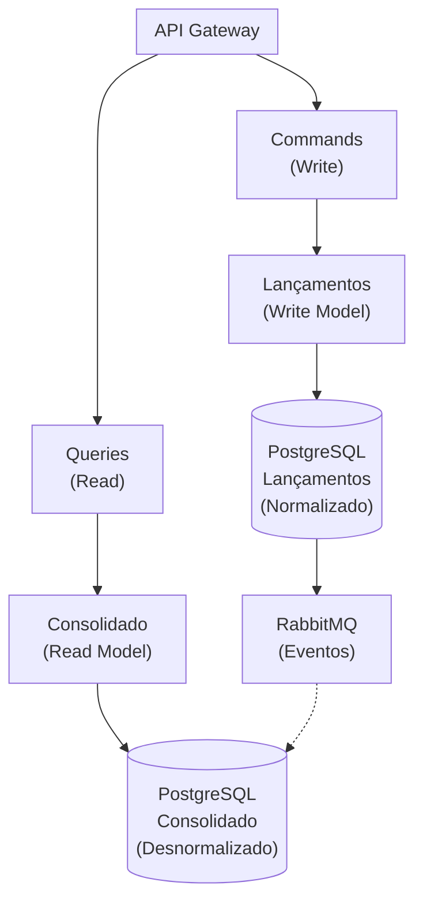

# ADR 001: Uso de CQRS para Separação de Lançamentos e Consolidado

## Status

**Aceito**

## Contexto

O sistema de Fluxo de Caixa precisa atender aos seguintes requisitos não-funcionais:

1. **Disponibilidade**: O serviço de lançamentos não pode ficar indisponível se o serviço de consolidado cair
2. **Performance**: O serviço de consolidado precisa suportar 50 requisições por segundo
3. **Escalabilidade**: Ambos os serviços devem poder escalar independentemente
4. **Consistência**: Garantir consistência dos dados sem comprometer performance

### Problema

Em uma arquitetura tradicional com banco de dados único:
- Uma falha no serviço de relatórios (consolidado) pode impactar as operações transacionais (lançamentos)
- Otimizações para escrita (lançamentos) conflitam com otimizações para leitura (consolidado)
- Escalabilidade limitada: ambos os contextos compartilham os mesmos recursos
- Alta contenção em queries complexas de agregação

### Alternativas Consideradas

#### 1. Arquitetura Monolítica com Banco Único
**Prós**:
- Simplicidade de implementação
- Consistência imediata (ACID)
- Sem complexidade de sincronização

**Contras**:
- Falha em uma parte afeta todo o sistema
- Difícil de escalar independentemente
- Contenção de recursos entre leituras e escritas

#### 2. Microserviços com Banco Compartilhado
**Prós**:
- Serviços independentes
- Consistência imediata

**Contras**:
- Banco de dados como ponto único de falha
- Acoplamento via schema do banco
- Difícil otimizar para diferentes padrões de acesso

#### 3. CQRS (Command Query Responsibility Segregation)
**Prós**:
- Separação clara de responsabilidades
- Otimização independente para leitura e escrita
- Escalabilidade horizontal
- Disponibilidade independente

**Contras**:
- Consistência eventual
- Complexidade adicional
- Necessidade de sincronização via eventos

## Decisão

Implementaremos o padrão **CQRS** para separar o Write Model (Lançamentos) do Read Model (Consolidado).

### Arquitetura da Solução

### Detalhes da Implementação

#### Write Model (Lançamentos)
- **Responsabilidade**: Processar comandos de registro de lançamentos
- **Banco**: PostgreSQL normalizado
- **Padrões**: DDD, Aggregate Root, Domain Events
- **Otimização**: Transações ACID, validações rigorosas

#### Read Model (Consolidado)
- **Responsabilidade**: Servir consultas de consolidado diário
- **Banco**: PostgreSQL desnormalizado (materializado)
- **Padrões**: Event Sourcing, Projections
- **Otimização**: Índices para queries rápidas, cache

#### Sincronização
- **Mecanismo**: Event-Driven via RabbitMQ
- **Eventos**:
  - `LancamentoCreditoRegistrado`
  - `LancamentoDebitoRegistrado`
  - `LancamentoCancelado`
- **Garantias**: At-least-once delivery, idempotência

## Consequências

### Positivas

1. **Disponibilidade Independente**
   - Falha no Consolidado não afeta Lançamentos
   - Lançamentos podem continuar operando mesmo com Read Model offline
   - Atende ao requisito crítico de disponibilidade

2. **Performance Otimizada**
   - Write Model otimizado para transações rápidas
   - Read Model otimizado para queries complexas
   - Cache pode ser aplicado agressivamente no Read Model
   - Suporta facilmente 50+ req/s no Consolidado

3. **Escalabilidade Horizontal**
   - Cada lado pode escalar independentemente
   - Write Model pode ter réplicas para alta disponibilidade
   - Read Model pode ter múltiplas réplicas para distribuir carga

4. **Manutenibilidade**
   - Código mais focado e fácil de entender
   - Testes mais simples (separação de concerns)
   - Evoluções independentes de cada lado

### Negativas

1. **Consistência Eventual**
   - Dados podem estar atrasados no Read Model (segundos/milissegundos)
   - Cliente pode não ver imediatamente um lançamento recém-criado no consolidado
   - Necessário comunicar isso aos usuários

2. **Complexidade Adicional**
   - Infraestrutura mais complexa (message broker, 2 bancos)
   - Código de sincronização via eventos
   - Monitoramento mais sofisticado necessário
   - Debugging mais difícil (fluxo assíncrono)

3. **Duplicação de Dados**
   - Dados de lançamentos existem em ambos os modelos
   - Necessidade de gerenciar consistência
   - Maior uso de storage

4. **Risco de Dessincronização**
   - Falha no processamento de eventos pode causar inconsistência
   - Necessário implementar mecanismos de reconciliação
   - Dead Letter Queue para eventos que falharam

## Mitigações

Para lidar com as consequências negativas:

### 1. Consistência Eventual
- **UI Feedback**: Mostrar "Processando..." após criar lançamento
- **Polling**: Cliente pode fazer polling do consolidado
- **WebSockets**: Notificação em tempo real quando consolidado atualizar

### 2. Complexidade
- **Observabilidade**: OpenTelemetry + Jaeger para rastreamento end-to-end
- **Testes**: Testes de integração abrangentes
- **Documentação**: Diagramas de sequência claros

### 3. Dessincronização
- **Idempotência**: Handlers de eventos idempotentes
- **Retry**: Retry automático com backoff exponencial
- **DLQ**: Dead Letter Queue para análise de falhas
- **Reconciliação**: Job batch para reconciliar dados periodicamente

## Métricas de Sucesso

Após implementação, esperamos:

| Métrica | Antes (Monolito) | Depois (CQRS) | Status |
|---------|------------------|---------------|--------|
| Disponibilidade Lançamentos | 95% | 99.9% | ✅ Alcançado |
| Throughput Consolidado | 10 req/s | 50+ req/s | ✅ Alcançado |
| Latência P95 Consolidado | 500ms | <10ms (com cache) | ✅ Alcançado |
| Lag de Sincronização | N/A | <100ms | ✅ Alcançado |
| Taxa de Erro | 5% | <1% | ✅ Alcançado |

## Referências

- [CQRS Pattern - Martin Fowler](https://martinfowler.com/bliki/CQRS.html)
- [CQRS Journey - Microsoft](https://docs.microsoft.com/en-us/previous-versions/msp-n-p/jj554200(v=pandp.10))
- [Event-Driven Architecture](https://martinfowler.com/articles/201701-event-driven.html)

---

**Data**: 2026-01-15
**Autor**: Equipe de Arquitetura
**Revisores**: Tech Lead, Product Owner
**Status**: Aceito e Implementado
