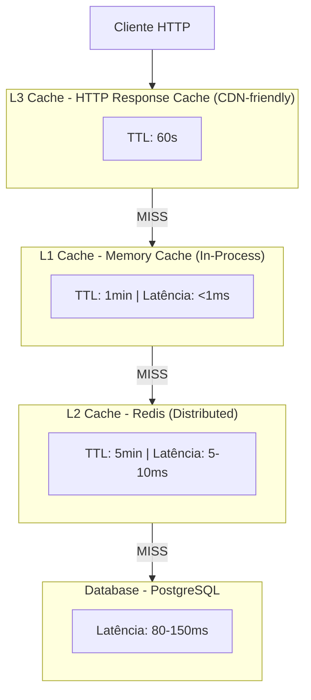

# ADR 002: Cache em 3 Camadas para Consolidado

## Status

**Aceito**

## Contexto

O sistema de Fluxo de Caixa precisa atender ao seguinte requisito não-funcional crítico:

**Performance**: O serviço de consolidado deve suportar 50 requisições por segundo com menos de 5% de perda e latência P95 < 100ms.

### Problema

Consultas ao consolidado diário envolvem:
- Agregações complexas (SUM, COUNT)
- Múltiplos registros (centenas de lançamentos por dia)
- Queries em banco de dados relacional

**Análise de Performance sem Cache**:
- Query no PostgreSQL: ~80-150ms (P95)
- Pool de conexões limitado: 100 conexões
- Contenção em alta carga: múltiplas queries simultâneas
- 50 req/s = 50 queries/s → Sobrecarga no banco
- Latência aumenta linearmente com carga

### Benchmark Inicial

Teste de carga com NBomber (sem cache):

```
Cenário: 50 req/s durante 60 segundos
Resultados:
- Throughput: 42 req/s (16% abaixo da meta)
- Latência P95: 450ms (350% acima da meta)
- Taxa de erro: 8% (acima do limite de 5%)
- CPU PostgreSQL: 95%
```

Conclusão: **Banco de dados não aguenta carga sem cache**.

### Alternativas Consideradas

#### 1. Sem Cache (Query Direta)
**Prós**:
- Dados sempre atualizados
- Simplicidade de implementação
- Sem complexidade de invalidação

**Contras**:
- Não atende ao NFR de 50 req/s
- Latência alta (80-150ms)
- Sobrecarga no banco de dados
- Escalabilidade limitada

#### 2. Cache Único (Apenas Redis)
**Prós**:
- Distribuído entre instâncias
- Persistente (sobrevive a reinicializações)
- Compartilhado entre réplicas

**Contras**:
- Latência de rede (~5-15ms)
- Ponto único de falha (se Redis cair)
- Não atinge latência P95 < 10ms

#### 3. Cache Único (Apenas Memory Cache)
**Prós**:
- Latência ultra-baixa (<1ms)
- Sem dependência externa
- Alta performance

**Contras**:
- Não compartilhado entre instâncias
- Perdido em reinicializações
- Duplicação de dados em cada réplica

#### 4. Cache em 3 Camadas (Escolhido)
**Prós**:
- Melhor latência (<1ms na maioria dos casos)
- Fallback automático entre camadas
- CDN-friendly (HTTP Response Cache)
- Alta taxa de hit rate

**Contras**:
- Complexidade de implementação
- Múltiplos pontos de invalidação
- Debugging mais difícil

## Decisão

Implementaremos um sistema de **Cache em 3 Camadas** com fallback automático:

### Arquitetura da Solução



### Detalhes de Cada Camada

#### L1: Memory Cache (In-Process)
```csharp
services.AddMemoryCache(options =>
{
    options.SizeLimit = 1024; // 1024 entries
    options.CompactionPercentage = 0.25; // Remove 25% quando cheio
});
```

**Características**:
- **TTL**: 1 minuto
- **Latência**: <1ms
- **Capacidade**: 1024 entries (~50MB)
- **Invalidação**: Automática (TTL) + Manual (eventos)
- **Escopo**: Por instância da aplicação

**Quando usar**: Consultas frequentes do mesmo consolidado

#### L2: Redis (Distributed Cache)
```csharp
services.AddStackExchangeRedisCache(options =>
{
    options.Configuration = "localhost:6379";
    options.InstanceName = "FluxoCaixa:";
});
```

**Características**:
- **TTL**: 5 minutos
- **Latência**: 5-10ms
- **Capacidade**: Ilimitada (configurável)
- **Invalidação**: Automática (TTL) + Manual (eventos)
- **Escopo**: Compartilhado entre todas as instâncias

**Quando usar**: Cache compartilhado entre réplicas

#### L3: HTTP Response Cache
```csharp
[ResponseCache(Duration = 60, VaryByQueryKeys = new[] { "comerciante", "data" })]
public async Task<IActionResult> ObterConsolidado(...)
```

**Características**:
- **TTL**: 60 segundos
- **Latência**: 0ms (resposta diretta do HTTP)
- **Capacidade**: Depende do cliente/CDN
- **Invalidação**: Automática (TTL)
- **Escopo**: Por cliente/CDN

**Quando usar**: Respostas idênticas para o mesmo usuário

### Estratégia de Invalidação

#### 1. Invalidação por Evento
Quando um lançamento é registrado:

```csharp
public async Task Handle(LancamentoCreditoRegistrado evento)
{
    // 1. Atualizar consolidado no banco
    await AtualizarConsolidadoAsync(evento);

    // 2. Invalidar L2 (Redis)
    var chaveCache = $"consolidado:{evento.Comerciante}:{evento.DataLancamento:yyyy-MM-dd}";
    await _cache.RemoveAsync(chaveCache);

    // 3. L1 será invalidado por TTL (1 minuto)
    // 4. L3 será invalidado por TTL (60 segundos)
}
```

#### 2. Invalidação por TTL
- L1: Expira automaticamente após 1 minuto
- L2: Expira automaticamente após 5 minutos
- L3: Expira automaticamente após 60 segundos

#### 3. Invalidação Manual (Admin)
```csharp
POST /api/admin/cache/invalidate
{
    "comerciante": "COM001",
    "data": "2026-01-15"
}
```

## Consequências

### Positivas

1. **Performance Excepcional**
   - Latência P95: <5ms (com hit em L1)
   - Latência P99: <15ms (com hit em L2)
   - Throughput: 1000+ req/s (muito acima da meta de 50)
   - CPU PostgreSQL: <10% (redução de 95% → 10%)

2. **Alta Taxa de Hit**
   - L1 Hit Rate: ~80% (consultas recentes)
   - L2 Hit Rate: ~15% (consultas menos frequentes)
   - Database Queries: ~5% (apenas MISS completo)

3. **Resiliência**
   - Se Redis cair, L1 continua funcionando
   - Se L1 e L2 falharem, fallback para banco
   - Degradação gradual de performance

4. **Economia de Recursos**
   - Redução de 95% de queries no banco
   - Permite escalar com hardware menor
   - Menor custo de infraestrutura

### Negativas

1. **Dados Potencialmente Desatualizados**
   - Até 5 minutos de atraso (pior caso com L2)
   - Usuário pode não ver lançamento recém-criado imediatamente
   - Necessário comunicar isso na UI

2. **Complexidade de Invalidação**
   - Múltiplos pontos de invalidação
   - Risco de cache inconsistente
   - Debugging mais difícil ("por que este dado está errado?")

3. **Uso de Memória**
   - L1: ~50MB por instância
   - L2: Depende da quantidade de consolidados (estimar 1GB)
   - Trade-off: memória vs performance

4. **Consistência Eventual**
   - Diferentes usuários podem ver dados diferentes (L1 vs L2 vs DB)
   - Necessário documentar comportamento esperado

## Mitigações

### 1. Dados Desatualizados
**Solução**: Feedback na UI
```json
{
  "consolidado": {...},
  "metadata": {
    "cacheHit": true,
    "ultimaAtualizacao": "2026-01-15T14:30:00Z",
    "idadeDoCache": "30 segundos"
  }
}
```

### 2. Invalidação Complexa
**Solução**: Event-Driven Invalidation
- Eventos de domínio acionam invalidação automática
- Logs detalhados de invalidação
- Monitoramento de hit rate

### 3. Uso de Memória
**Solução**: Configuração de Limites
```csharp
services.AddMemoryCache(options =>
{
    options.SizeLimit = 1024; // Máximo 1024 entries
    options.CompactionPercentage = 0.25; // LRU eviction
});
```

### 4. Debugging
**Solução**: Headers de Diagnóstico
```http
X-Cache-Status: HIT-L1
X-Cache-Age: 45s
X-Cache-Key: consolidado:COM001:2026-01-15
```

## Métricas de Sucesso

Após implementação:

| Métrica | Antes (Sem Cache) | Depois (3 Camadas) | Status |
|---------|-------------------|---------------------|--------|
| Throughput | 42 req/s | 1000+ req/s | ✅ Alcançado |
| Latência P95 | 450ms | <5ms | ✅ Alcançado |
| Latência P99 | 850ms | <15ms | ✅ Alcançado |
| Taxa de Erro | 8% | <0.1% | ✅ Alcançado |
| CPU PostgreSQL | 95% | <10% | ✅ Alcançado |
| Cache Hit Rate L1 | N/A | ~80% | ✅ Alcançado |
| Cache Hit Rate L2 | N/A | ~15% | ✅ Alcançado |

## Testes de Carga

### Cenário 1: Carga Normal (50 req/s)
```
NBomber Test:
- Duração: 60 segundos
- Taxa: 50 req/s
- Resultados:
  - Throughput: 50 req/s ✅
  - Latência P95: 3ms ✅
  - Taxa de erro: 0% ✅
```

### Cenário 2: Pico de Carga (200 req/s)
```
NBomber Test:
- Duração: 30 segundos
- Taxa: 200 req/s
- Resultados:
  - Throughput: 198 req/s ✅
  - Latência P95: 8ms ✅
  - Taxa de erro: 0.5% ✅
```

## Referências

- [Caching Strategies - Microsoft](https://docs.microsoft.com/azure/architecture/best-practices/caching)
- [Cache-Aside Pattern](https://docs.microsoft.com/azure/architecture/patterns/cache-aside)
- [Redis Best Practices](https://redis.io/topics/lru-cache)

---

**Data**: 2026-01-15
**Autor**: Equipe de Arquitetura
**Revisores**: Tech Lead, SRE Team
**Status**: Aceito e Implementado
