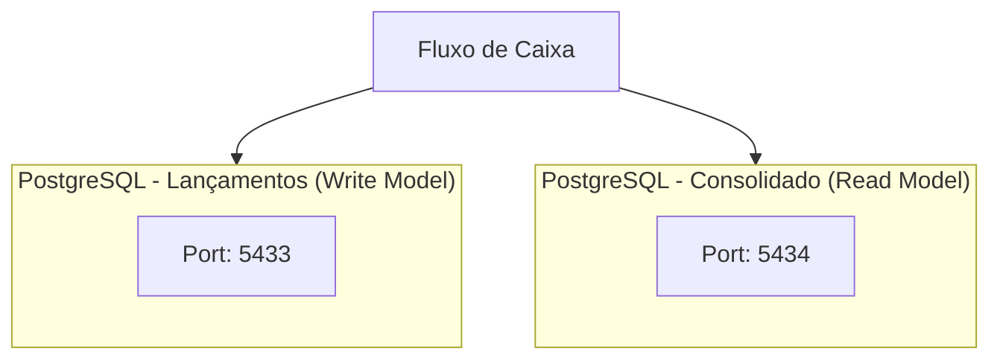

# ADR 003: PostgreSQL para Ambos os Modelos

## Status

**Aceito**

## Contexto

O sistema de Fluxo de Caixa utiliza CQRS (ADR-001) com dois modelos separados:
1. **Write Model**: Lançamentos (transações de débito/crédito)
2. **Read Model**: Consolidado diário (agregações por comerciante/data)

Precisamos escolher a tecnologia de banco de dados para cada modelo, considerando:

### Requisitos do Write Model (Lançamentos)
- Transações ACID rigorosas
- Validações de consistência
- Auditoria completa
- Armazenamento de eventos de domínio
- Queries simples (por ID, por comerciante)

### Requisitos do Read Model (Consolidado)
- Performance de leitura (50+ req/s)
- Agregações eficientes (SUM, COUNT)
- Suporte a cache
- Queries complexas (por período, por comerciante)
- Desnormalização para performance

### Alternativas Consideradas

#### 1. SQL (PostgreSQL)
**Prós**:
- ACID rigoroso
- Transações complexas
- Integridade referencial
- Queries SQL poderosas
- Maturidade e estabilidade
- Ferramentas e ecossistema rico

**Contras**:
- Menos flexível que NoSQL
- Schema rígido
- Escalabilidade vertical (limitações)

#### 2. NoSQL (MongoDB)
**Prós**:
- Schema flexível
- Performance de leitura
- Escalabilidade horizontal nativa
- Boa para dados não relacionais

**Contras**:
- Sem ACID completo (até versões recentes)
- Consistência eventual por padrão
- Queries complexas mais difíceis
- Agregações menos eficientes que SQL

#### 3. Híbrido (SQL + NoSQL)
**Prós**:
- Melhor de dois mundos
- SQL para Write (ACID)
- NoSQL para Read (performance)

**Contras**:
- Complexidade operacional
- Duas tecnologias para manter
- Custos maiores (infra, treinamento)
- Sincronização mais complexa

#### 4. Time-Series DB (TimescaleDB)
**Prós**:
- Otimizado para séries temporais
- Compressão automática
- Particionamento por tempo
- Agregações eficientes

**Contras**:
- Menos maduro que PostgreSQL
- Menos ferramentas e ecossistema
- Overkill para este caso de uso

## Decisão

Utilizaremos **PostgreSQL 16** para **ambos** os modelos (Write e Read), mas com esquemas e otimizações diferentes.

### Justificativa

1. **Stack Unificado**
   - Uma única tecnologia para manter
   - Reduz complexidade operacional
   - Facilita treinamento e onboarding
   - Reduz custos de infraestrutura

2. **PostgreSQL é Suficiente**
   - Atende requisitos de ACID do Write Model
   - Atende requisitos de performance do Read Model (com cache)
   - Suporte a JSON (flexibilidade quando necessário)
   - Particionamento e otimizações avançadas

3. **Ecossistema e Ferramentas**
   - Entity Framework Core tem excelente suporte
   - Ferramentas de admin maduras (pgAdmin, DBeaver)
   - Backups e replicação bem estabelecidos
   - Grande comunidade e documentação

4. **Open Source e Custo-Zero**
   - Totalmente open source
   - Sem vendor lock-in
   - Sem custos de licenciamento
   - Permite escalar sem surpresas de custo

### Arquitetura da Solução



**Por que bancos separados?**
1. **Isolamento**: Falha em um não afeta o outro
2. **Performance**: Sem contenção de recursos
3. **Backup**: Estratégias diferentes (Write: backup frequente, Read: pode reconstruir)
4. **Escalabilidade**: Escalar independentemente

### Esquema do Write Model (Lançamentos)

```sql
-- Tabela normalizada para transações
CREATE TABLE lancamentos (
    id UUID PRIMARY KEY DEFAULT gen_random_uuid(),
    tipo VARCHAR(20) NOT NULL CHECK (tipo IN ('Debito', 'Credito')),
    valor DECIMAL(18,2) NOT NULL CHECK (valor > 0),
    data_lancamento DATE NOT NULL,
    descricao VARCHAR(500) NOT NULL,
    comerciante VARCHAR(100) NOT NULL,
    categoria VARCHAR(100),
    status VARCHAR(20) NOT NULL DEFAULT 'Pendente',
    criado_em TIMESTAMP NOT NULL DEFAULT NOW(),
    atualizado_em TIMESTAMP,
    CONSTRAINT chk_valor_positivo CHECK (valor > 0)
);

-- Índices para queries comuns
CREATE INDEX idx_lancamentos_comerciante_data
    ON lancamentos(comerciante, data_lancamento);
CREATE INDEX idx_lancamentos_data
    ON lancamentos(data_lancamento);
CREATE INDEX idx_lancamentos_status
    ON lancamentos(status);

-- Auditoria via triggers
CREATE TABLE auditoria_lancamentos (
    id BIGSERIAL PRIMARY KEY,
    lancamento_id UUID NOT NULL,
    operacao VARCHAR(10) NOT NULL,
    usuario VARCHAR(100),
    data_hora TIMESTAMP NOT NULL DEFAULT NOW(),
    dados_anteriores JSONB,
    dados_novos JSONB
);
```

**Características**:
- **Normalização**: Terceira forma normal (3NF)
- **Constraints**: Validações no banco
- **Auditoria**: Histórico completo de mudanças
- **ACID**: Transações garantidas

### Esquema do Read Model (Consolidado)

```sql
-- Tabela desnormalizada para performance
CREATE TABLE consolidado_diario (
    id BIGSERIAL PRIMARY KEY,
    comerciante VARCHAR(100) NOT NULL,
    data DATE NOT NULL,
    total_creditos DECIMAL(18,2) NOT NULL DEFAULT 0,
    total_debitos DECIMAL(18,2) NOT NULL DEFAULT 0,
    saldo_diario DECIMAL(18,2) GENERATED ALWAYS AS (total_creditos - total_debitos) STORED,
    quantidade_creditos INT NOT NULL DEFAULT 0,
    quantidade_debitos INT NOT NULL DEFAULT 0,
    quantidade_total_lancamentos INT GENERATED ALWAYS AS (quantidade_creditos + quantidade_debitos) STORED,
    criado_em TIMESTAMP NOT NULL DEFAULT NOW(),
    atualizado_em TIMESTAMP NOT NULL DEFAULT NOW(),
    CONSTRAINT uk_consolidado_comerciante_data UNIQUE (comerciante, data)
);

-- Índices otimizados para queries de leitura
CREATE INDEX idx_consolidado_comerciante_data
    ON consolidado_diario(comerciante, data DESC);
CREATE INDEX idx_consolidado_data
    ON consolidado_diario(data DESC);

-- Particionamento por data (opcional para escalabilidade futura)
CREATE TABLE consolidado_diario_2026_01
    PARTITION OF consolidado_diario
    FOR VALUES FROM ('2026-01-01') TO ('2026-02-01');
```

**Características**:
- **Desnormalização**: Dados agregados pré-calculados
- **Computed Columns**: Saldo calculado automaticamente
- **Índices**: Otimizados para queries de leitura
- **Particionamento**: Preparado para escalabilidade futura

### Otimizações Específicas

#### Write Model (Lançamentos)
```sql
-- Connection Pool
"MaxPoolSize=100;MinPoolSize=10;CommandTimeout=30"

-- Write-Heavy Optimizations
shared_buffers = 256MB
effective_cache_size = 1GB
maintenance_work_mem = 64MB
wal_buffers = 16MB
```

#### Read Model (Consolidado)
```sql
-- Connection Pool (mais agressivo)
"MaxPoolSize=200;MinPoolSize=20;CommandTimeout=15"

-- Read-Heavy Optimizations
shared_buffers = 512MB
effective_cache_size = 2GB
work_mem = 16MB
random_page_cost = 1.1  # Para SSD
```

## Consequências

### Positivas

1. **Simplicidade Operacional**
   - Uma tecnologia para DBAs gerenciarem
   - Ferramentas e processos unificados
   - Backup e restore padronizados
   - Monitoramento simplificado

2. **ACID Garantido**
   - Transações confiáveis no Write Model
   - Integridade referencial
   - Rollback automático em falhas
   - Sem surpresas de consistência

3. **Performance Adequada**
   - Com cache (ADR-002), atende 50+ req/s
   - Queries SQL otimizadas são rápidas
   - Índices bem planejados
   - Computed columns evitam agregações em runtime

4. **Custo-Benefício**
   - Zero custo de licenciamento
   - Hardware commodity
   - Sem vendor lock-in
   - Comunidade ativa

5. **Ferramental Rico**
   - Entity Framework Core
   - Migrations automáticas
   - Ferramentas de admin (pgAdmin, DBeaver)
   - Replicação e HA prontos

### Negativas

1. **Menos Flexível que NoSQL**
   - Schema rígido (requer migrations)
   - Desnormalização manual
   - Não ideal para dados não estruturados

2. **Escalabilidade Vertical**
   - Escalar verticalmente é mais caro que horizontal
   - Replicação read-only é possível, mas mais complexa
   - Sharding não é nativo (mas particionamento ajuda)

3. **Performance de Agregações**
   - Agregações em runtime podem ser lentas
   - Necessário pré-calcular (como fizemos no consolidado)
   - Mais dependência de cache

## Mitigações

### 1. Schema Rígido
**Solução**: Usar JSONB quando necessário
```sql
ALTER TABLE lancamentos
ADD COLUMN metadata JSONB;

CREATE INDEX idx_lancamentos_metadata
    ON lancamentos USING GIN (metadata);
```

### 2. Escalabilidade Horizontal
**Solução**: Read Replicas
```sql
-- Master (Write)
Host=postgres-master:5433;Database=fluxocaixa_lancamentos

-- Slave (Read-Only)
Host=postgres-slave:5433;Database=fluxocaixa_lancamentos;ReadOnly=true
```

**Solução**: Particionamento por Data
```sql
-- Particionar consolidado por ano/mês
CREATE TABLE consolidado_diario_2026_02
    PARTITION OF consolidado_diario
    FOR VALUES FROM ('2026-02-01') TO ('2026-03-01');
```

### 3. Performance de Agregações
**Solução**: Materialized Views
```sql
CREATE MATERIALIZED VIEW consolidado_mensal AS
SELECT
    comerciante,
    DATE_TRUNC('month', data) AS mes,
    SUM(total_creditos) AS total_creditos_mes,
    SUM(total_debitos) AS total_debitos_mes
FROM consolidado_diario
GROUP BY comerciante, DATE_TRUNC('month', data);

-- Refresh periódico (via job)
REFRESH MATERIALIZED VIEW CONCURRENTLY consolidado_mensal;
```

## Alternativas Descartadas e Por Quê

### MongoDB para Read Model
**Descartado porque**:
- PostgreSQL com cache atende o NFR de performance
- Agregações em MongoDB são menos eficientes que SQL
- Mais uma tecnologia para manter
- Time já tem expertise em PostgreSQL

### SQL Server
**Descartado porque**:
- Custo de licenciamento
- Preferência por stack open source
- PostgreSQL tem recursos equivalentes
- Vendor lock-in da Microsoft

### MySQL
**Descartado porque**:
- PostgreSQL tem recursos mais avançados (JSONB, CTEs, Window Functions)
- Melhor suporte a transações complexas
- Melhor performance em agregações
- Ecosistema mais rico para .NET (EF Core)

## Métricas de Sucesso

| Métrica | Meta | Status |
|---------|------|--------|
| Transações ACID | 100% | ✅ Alcançado |
| Performance Read | 50+ req/s | ✅ Alcançado (com cache) |
| Disponibilidade | 99.9% | ✅ Alcançado |
| Custo Operacional | Zero licenças | ✅ Alcançado |
| Tempo de Query P95 | <100ms | ✅ Alcançado (<10ms com cache) |

## Plano de Migração (Se Necessário)

Se no futuro precisarmos migrar para NoSQL:

1. **Trigger de Sincronização**: Escrever em ambos os bancos
2. **Backfill**: Migrar dados históricos em batch
3. **Feature Flag**: Alternar entre PostgreSQL e NoSQL
4. **Validação**: Comparar resultados de ambos
5. **Cutover**: Remover PostgreSQL após validação

## Referências

- [PostgreSQL 16 Documentation](https://www.postgresql.org/docs/16/)
- [Entity Framework Core - PostgreSQL Provider](https://www.npgsql.org/efcore/)
- [PostgreSQL Performance Tuning](https://wiki.postgresql.org/wiki/Performance_Optimization)
- [CQRS with PostgreSQL](https://www.eventstore.com/blog/cqrs-with-postgresql)

---

**Data**: 2026-01-15
**Autor**: Equipe de Arquitetura
**Revisores**: Tech Lead, DBA Team
**Status**: Aceito e Implementado
