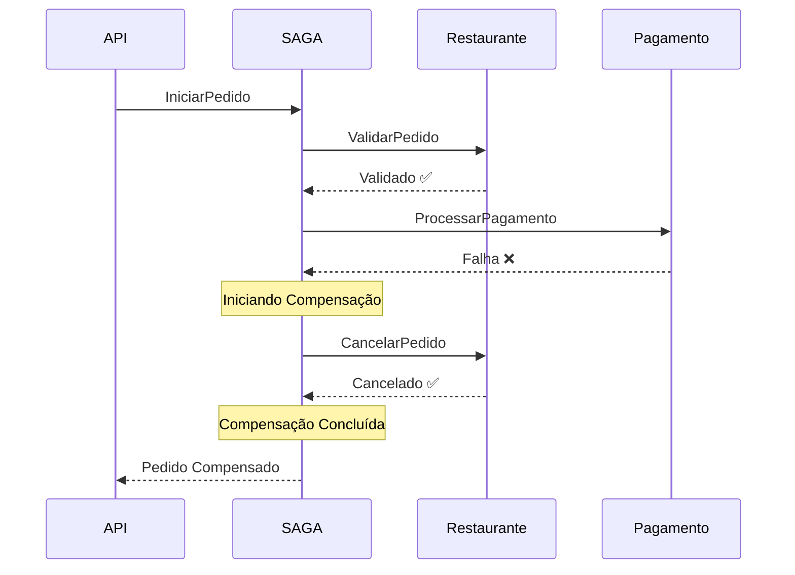
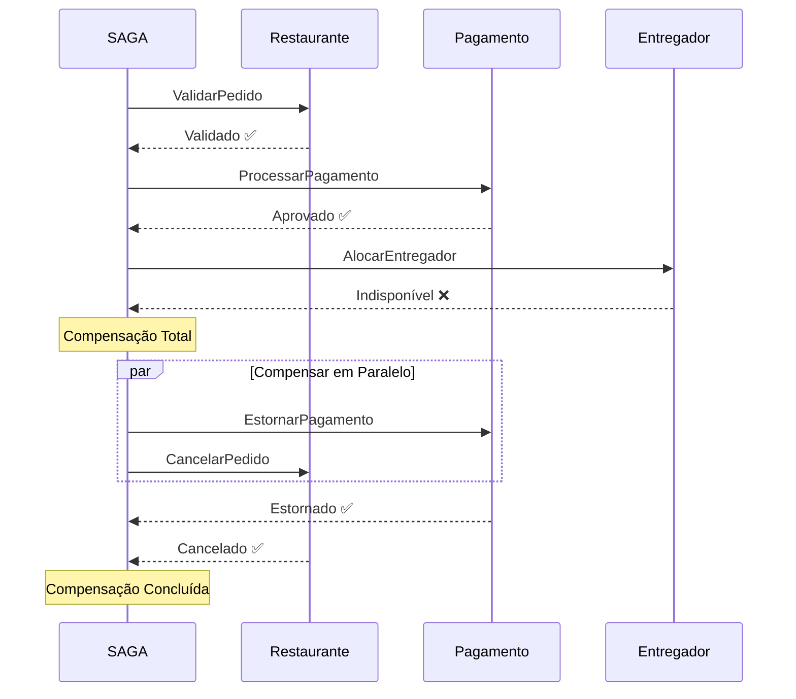
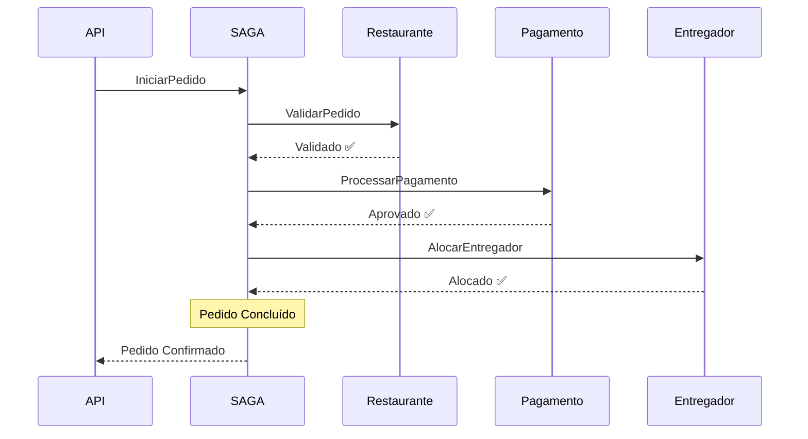
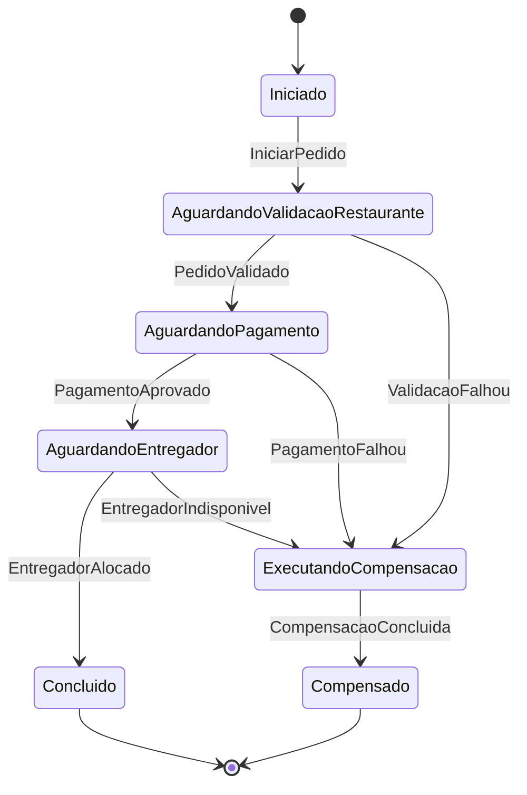
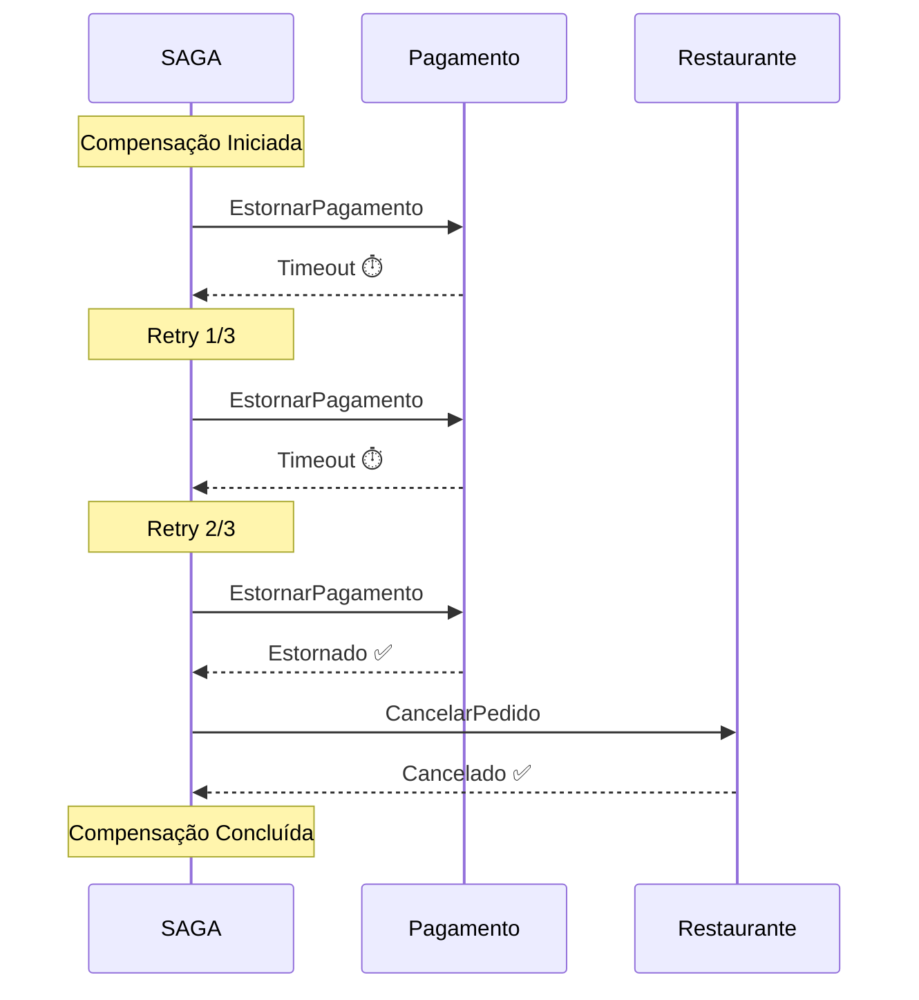
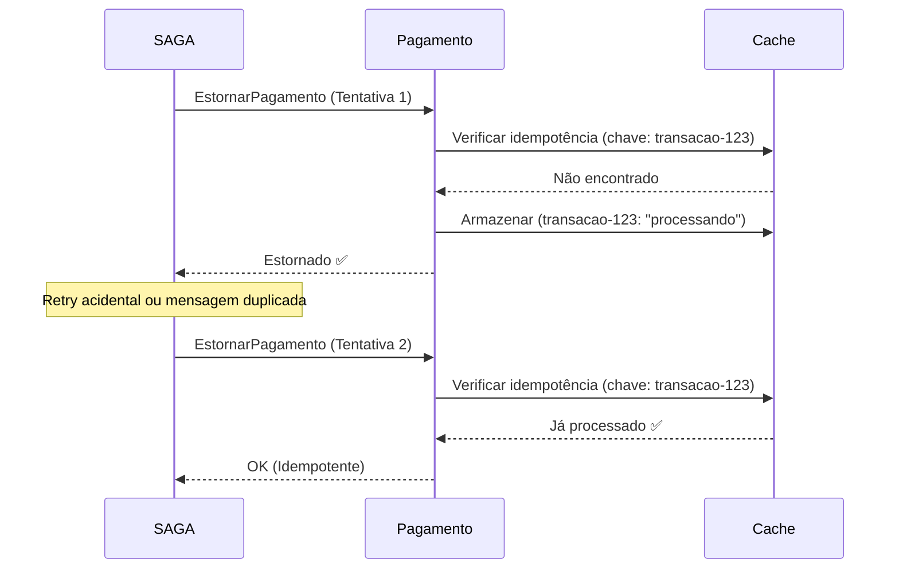
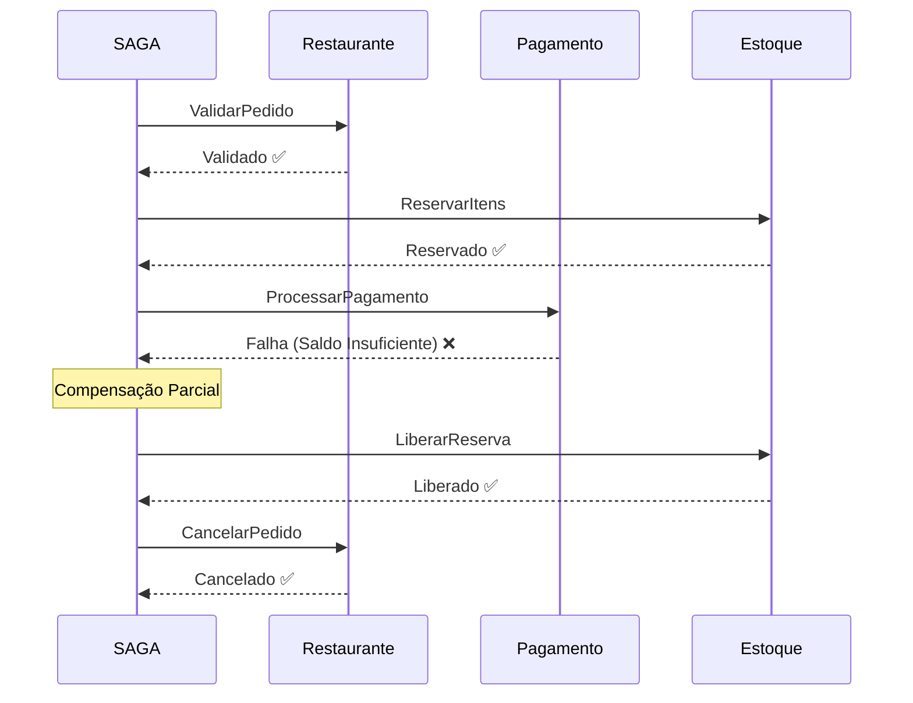
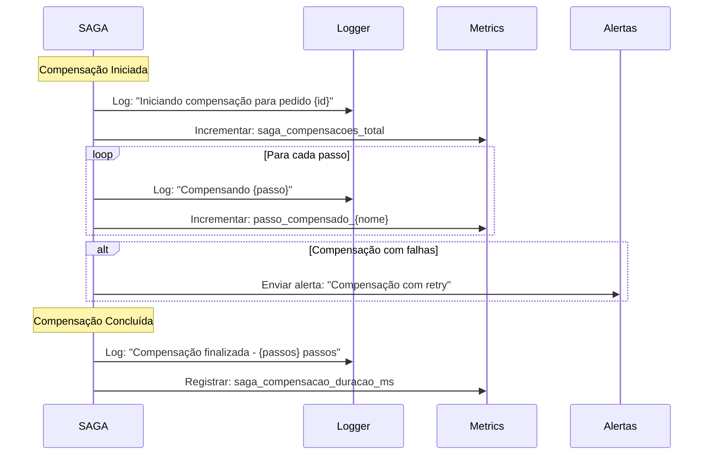

# Diagramas de Compensação - SAGA Pattern

Este documento apresenta os diagramas detalhados dos fluxos de compensação implementados no projeto SAGA POC.

---

## 1. Fluxo de Compensação - Falha no Pagamento

Cenário onde a validação do restaurante é bem-sucedida, mas o processamento do pagamento falha.

### Detalhes do Fluxo

1. **Início**: API recebe requisição de criação de pedido
2. **Validação**: Restaurante valida disponibilidade dos itens
3. **Falha no Pagamento**: Cartão recusado, saldo insuficiente, etc.
4. **Compensação**: Cancela a reserva dos itens no restaurante
5. **Resultado**: SAGA finalizada com status "Compensado"

### Estados da SAGA

- `Iniciado` → `AguardandoValidacaoRestaurante` → `AguardandoPagamento` → `ExecutandoCompensacao` → `Compensado`

---

## 2. Fluxo de Compensação - Falha no Entregador (Total)

Cenário onde restaurante e pagamento são bem-sucedidos, mas a alocação do entregador falha, exigindo compensação total.

### Detalhes do Fluxo

1. **Validação**: Restaurante confirma disponibilidade
2. **Pagamento**: Cobrança aprovada e confirmada
3. **Falha na Entrega**: Nenhum entregador disponível na região
4. **Compensação Paralela**:
   - Estorno do pagamento
   - Cancelamento do pedido no restaurante
5. **Resultado**: SAGA finalizada com status "Compensado"

### Estados da SAGA

- `Iniciado` → `AguardandoValidacaoRestaurante` → `AguardandoPagamento` → `AguardandoEntregador` → `ExecutandoCompensacao` → `Compensado`

---

## 3. Fluxo Completo de Sucesso (Referência)

Para comparação, este é o fluxo quando tudo funciona corretamente.

### Estados da SAGA

- `Iniciado` → `AguardandoValidacaoRestaurante` → `AguardandoPagamento` → `AguardandoEntregador` → `Concluido`

---

## 4. Diagrama de Estados da SAGA

---

## 5. Fluxo de Compensação com Retry

Cenário onde um passo de compensação falha e precisa ser reexecutado.

### Política de Retry

- **Tentativas**: 3 vezes
- **Intervalo**: Exponencial (1s, 2s, 4s)
- **Ação se falhar**: Enviar para Dead Letter Queue

---

## 6. Compensação com Idempotência

Diagrama mostrando como a idempotência previne execução duplicada.

---

## 7. Matriz de Compensação

Tabela de referência rápida para entender quais compensações são executadas em cada cenário.

| Falha no Passo | Restaurante | Pagamento | Entregador | Compensações Executadas |
|---------------|-------------|-----------|------------|------------------------|
| Validação Restaurante | ❌ | - | - | Nenhuma |
| Pagamento | ✅ | ❌ | - | Cancelar Restaurante |
| Entregador | ✅ | ✅ | ❌ | Estornar Pagamento + Cancelar Restaurante |

---

## 8. Tempo de Execução Típico

```mermaid
gantt
    title Duração Típica da SAGA (Sucesso)
    dateFormat  ss
    axisFormat  %Ss

    section Validação
    Validar Restaurante     :a1, 00, 2s

    section Pagamento
    Processar Pagamento     :a2, after a1, 3s

    section Entrega
    Alocar Entregador       :a3, after a2, 2s

    section Total
    SAGA Concluída          :milestone, after a3, 0s
```

**Tempo Total**: ~7 segundos (em condições normais)

---

## 9. Cenário de Compensação Parcial

Quando apenas uma parte da transação precisa ser compensada.

---

## 10. Observabilidade da Compensação

Eventos e logs gerados durante o processo de compensação.

---

## Notas Importantes

### Princípios de Compensação

1. **Ordem Reversa**: Compensações sempre executam na ordem inversa das transações
2. **Idempotência**: Cada compensação pode ser executada múltiplas vezes com o mesmo resultado
3. **Resiliência**: Compensações têm retry automático com backoff exponencial
4. **Auditoria**: Todos os passos de compensação são logados e rastreáveis

### Garantias

- ✅ Eventual consistência através das compensações
- ✅ Nenhuma transação fica "meio processada"
- ✅ Todos os passos bem-sucedidos são compensados em caso de falha
- ✅ Sistema retorna a um estado consistente mesmo após falhas

---

**Última atualização**: 2026-01-07
**Versão**: 1.0
