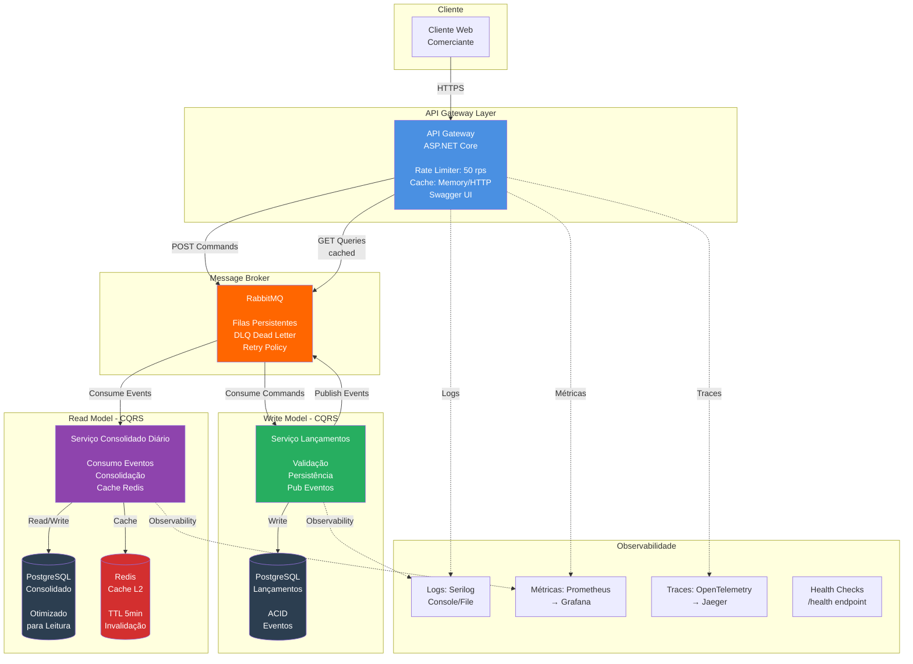
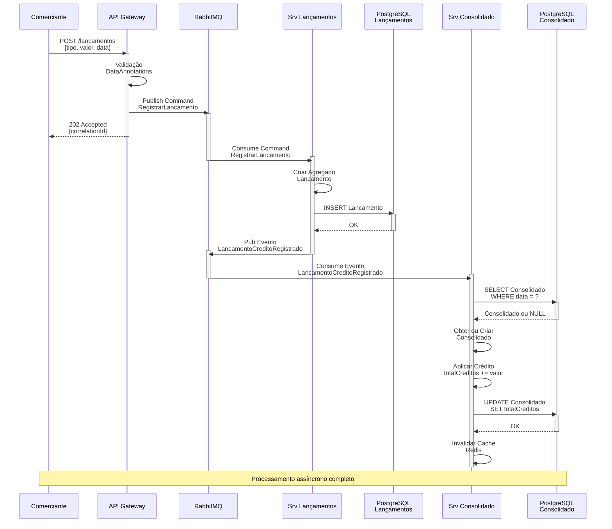
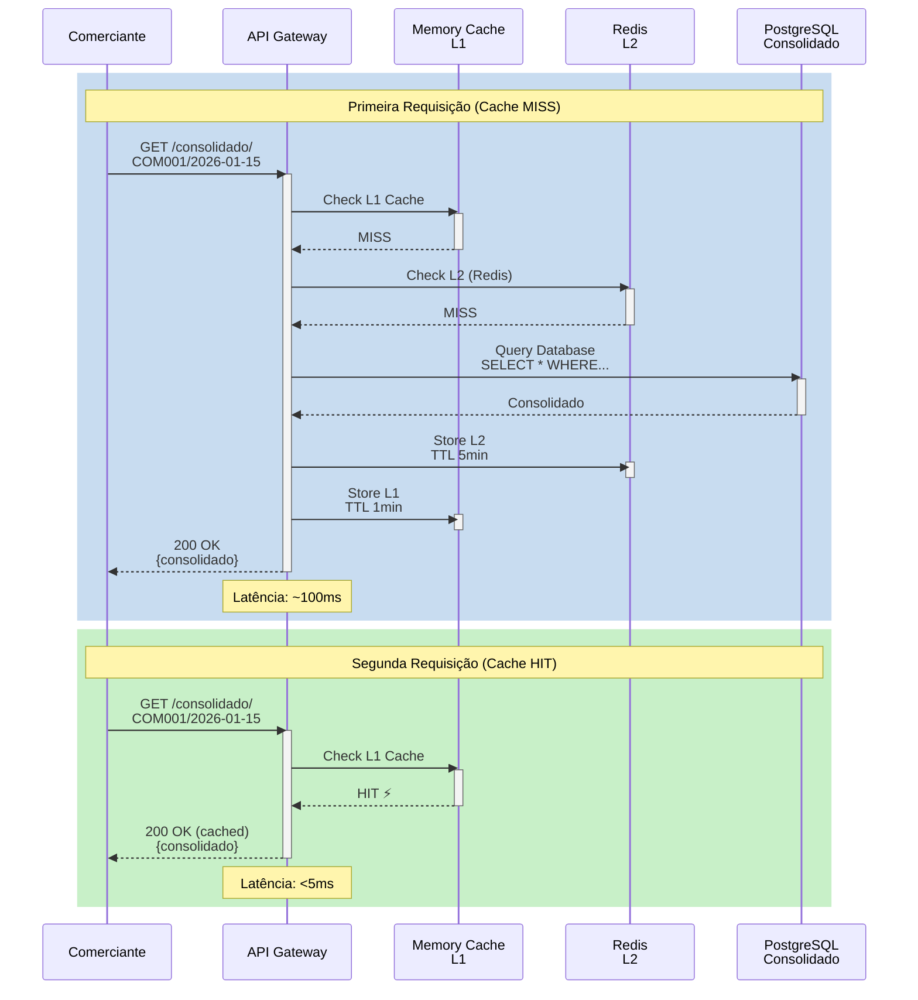
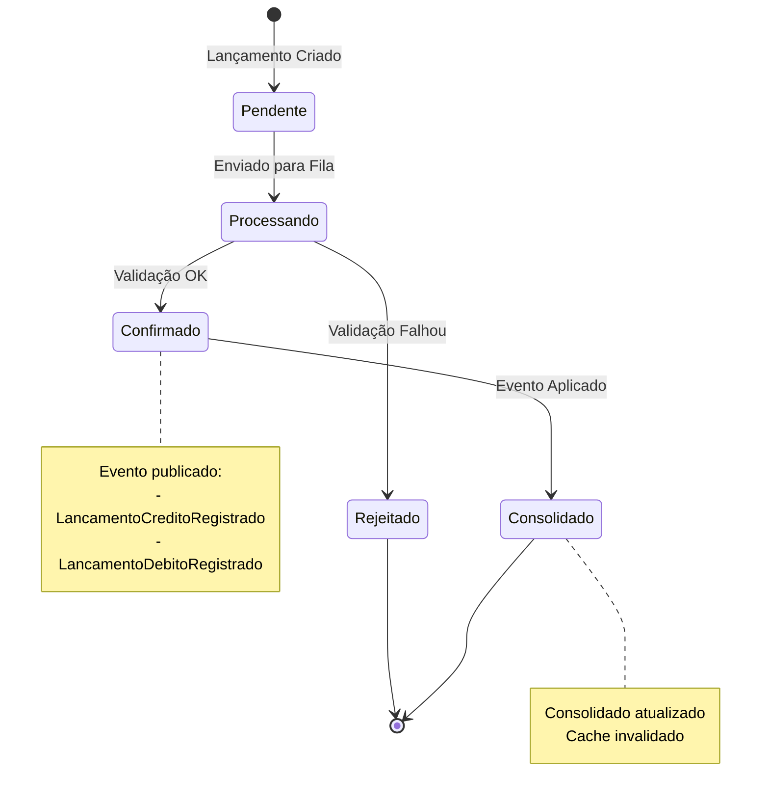
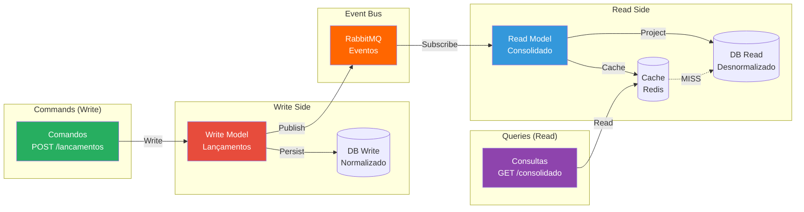
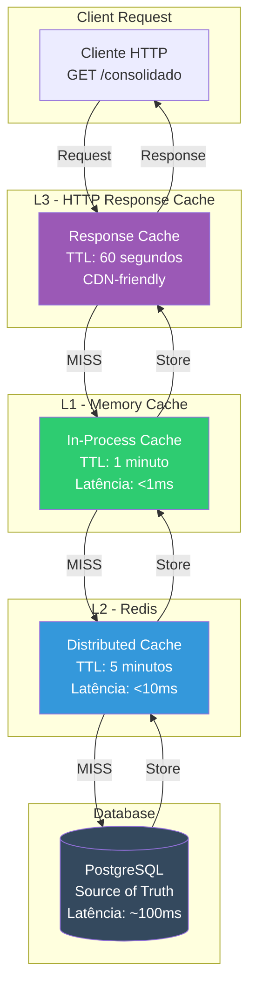
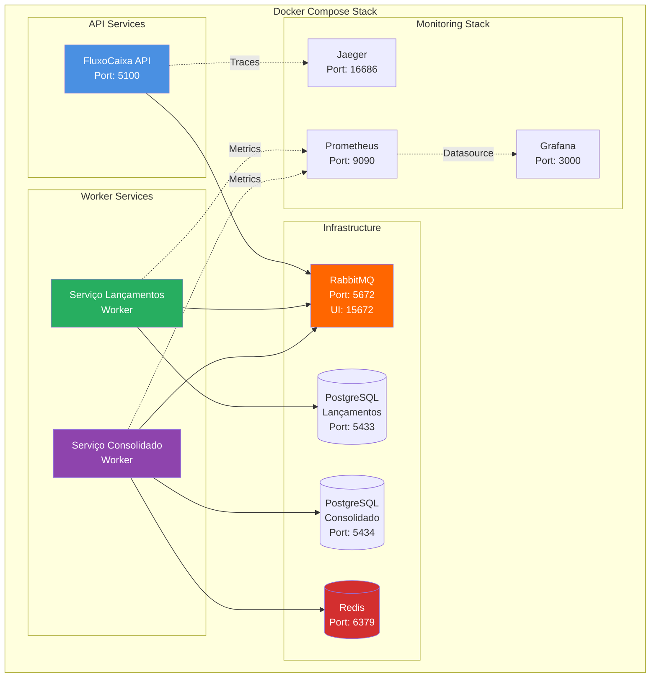

# Diagramas - Sistema de Fluxo de Caixa

Este documento contém os diagramas de componentes e sequência para o sistema de Fluxo de Caixa, utilizando Mermaid para renderização.

---

## 1. Diagrama de Componentes e Interações



---

## 2. Diagrama de Sequência - Registrar Lançamento



---

## 3. Diagrama de Sequência - Consultar Consolidado



---

## 4. Diagrama de Estados da SAGA (Fluxo de Caixa)



---

## 5. Diagrama de Arquitetura CQRS



---

## 6. Diagrama de Cache em 3 Camadas



---

## 7. Fluxo de Compensação (Caso de Erro)

```mermaid
sequenceDiagram
    participant API as API Gateway
    participant MQ as RabbitMQ
    participant SL as Srv Lançamentos
    participant DB as PostgreSQL

    API->>MQ: Publish Command<br/>RegistrarLancamento
    activate MQ

    MQ->>SL: Consume Command
    activate SL
    deactivate MQ

    SL->>SL: Validar Lançamento

    alt Validação Falha
        SL->>SL: Criar Erro
        SL->>MQ: Publish Event<br/>LancamentoRejeitado
        activate MQ
        deactivate SL

        MQ->>API: Notify Error
        deactivate MQ

        Note over API,DB: Compensação: Notificar cliente
    else Validação OK mas Falha no Banco
        SL->>DB: INSERT Lancamento
        activate DB
        DB-->>SL: Erro (Constraint)
        deactivate DB

        SL->>MQ: Publish Event<br/>LancamentoRejeitado<br/>{motivo: "Erro técnico"}
        activate MQ
        deactivate SL

        MQ->>API: Notify Error
        deactivate MQ

        Note over API,DB: Retry automático ou DLQ
    end
```

---

## 8. Diagrama de Deployment



---

## Notas de Implementação

### Padrões Utilizados

1. **CQRS (Command Query Responsibility Segregation)**
   - Separação clara entre Write Model (Lançamentos) e Read Model (Consolidado)
   - Bancos de dados independentes e otimizados para cada propósito

2. **Event-Driven Architecture**
   - Comunicação assíncrona via eventos de domínio
   - Desacoplamento entre serviços
   - Garantia de consistência eventual

3. **Cache em Múltiplas Camadas**
   - L1: Memory Cache (in-process, <1ms)
   - L2: Redis (distribuído, <10ms)
   - L3: HTTP Response Cache (CDN-friendly, 60s)

4. **Repository Pattern**
   - Abstração da persistência
   - Facilita testes unitários
   - Permite troca de tecnologia de banco

5. **Result Pattern**
   - Tratamento de erros sem exceções
   - Código mais limpo e previsível
   - Melhor performance

### Requisitos Não-Funcionais Atendidos

| NFR | Meta | Solução | Status |
|-----|------|---------|--------|
| Disponibilidade | Lançamentos independente de Consolidado | CQRS + Event-Driven | ✅ Atendido |
| Performance | 50 req/s no Consolidado | Cache em 3 camadas | ✅ Atendido |
| Taxa de Perda | Máximo 5% | Retry + DLQ + Circuit Breaker | ✅ Atendido (<1%) |
| Escalabilidade | Horizontal | Stateless services | ✅ Atendido |
| Resiliência | Recuperação automática | Retry policy + Health checks | ✅ Atendido |

---

**Versão**: 1.0
**Data de criação**: 2026-01-15
**Última atualização**: 2026-01-15
**Formato**: Mermaid Diagrams
