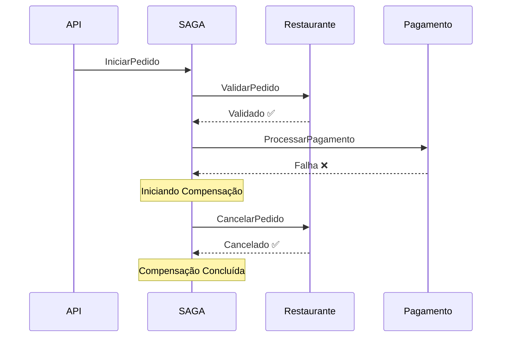
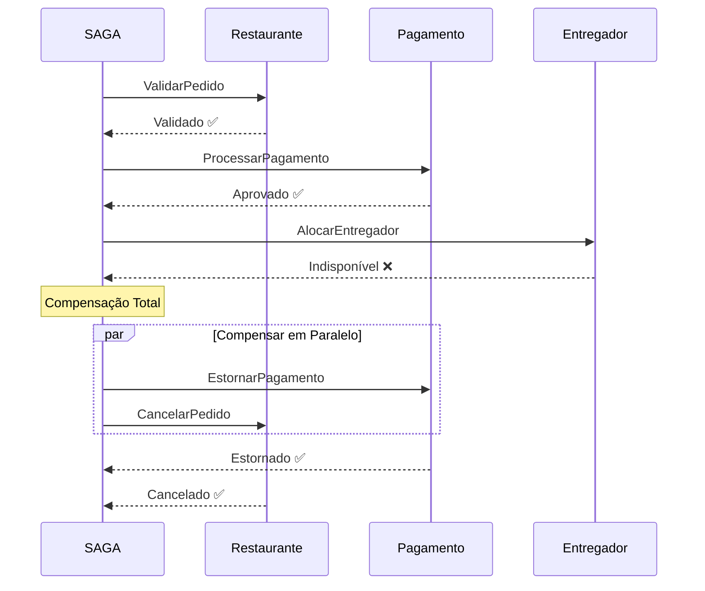

# FASE 14: Documentação e Refinamento Final


#### 3.14.1 Objetivos
- Criar diagramas de fluxo detalhados
- Documentar runbooks de troubleshooting
- Criar guia de boas práticas
- Adicionar exemplos de uso avançados

#### 3.14.2 Entregas

##### 1. **Diagrama de Compensação em Cascata (Mermaid)**

```markdown
# docs/diagramas-compensacao.md

### Fluxo de Compensação - Falha no Pagamento



### Fluxo de Compensação - Falha no Entregador (Total)


\`\`\`

##### 2. **Runbook de Troubleshooting**

```markdown
# docs/runbook-troubleshooting.md

## Runbook: SAGA Travada

### Sintomas
- SAGA não progride há mais de 10 minutos
- Estado da SAGA não muda
- Mensagens presas na fila

### Diagnóstico

#### 1. Verificar Estado da SAGA
```csharp
// Query no repositório (se SQL)
SELECT * FROM EstadoPedido
WHERE CorrelationId = '{id}'
ORDER BY DataInicio DESC;
```

### Ações Corretivas

#### Caso 1: Timeout em Serviço
- Verificar health check do serviço: `GET /health`
- Reiniciar serviço se necessário
- Re-enviar mensagem manualmente

#### Caso 2: Erro de Validação
- Verificar logs: `grep "{correlacaoId}" logs/*.log`
- Corrigir dados se necessário
- Executar compensação manual

#### Caso 3: Circuit Breaker Aberto
- Aguardar reset interval (5 minutos)
- Verificar saúde do serviço downstream
- Reiniciar se necessário

### Scripts de Compensação Manual

```csharp
// Executar compensação manual via API
POST /api/pedidos/{id}/compensar
{
  "motivo": "Timeout após 10 minutos",
  "executarEstorno": true
}
```
```

##### 3. **Guia de Boas Práticas**

```markdown
# docs/boas-praticas.md

## Boas Práticas - SAGA Pattern

### 1. Idempotência
- ✅ **SEMPRE** verificar idempotência antes de processar
- ✅ Usar chaves únicas (MessageId, TransacaoId, etc)
- ✅ Armazenar em cache/banco com TTL de 24-48h

### 2. Compensações
- ✅ Compensar em **ordem reversa**
- ✅ Compensações devem ser **idempotentes**
- ✅ Não lançar exceções em compensações
- ✅ Logar todas as compensações executadas

### 3. Timeouts
- ✅ Definir timeout para TODAS as operações
- ✅ Usar CancellationToken
- ✅ Timeout maior no orquestrador que nos serviços

### 4. Logs
- ✅ Incluir CorrelationId em TODOS os logs
- ✅ Usar log estruturado (Serilog, NLog)
- ✅ Log de início/fim de cada passo

### 5. Métricas
- ✅ Taxa de sucesso/falha por tipo de erro
- ✅ Duração de cada passo da SAGA
- ✅ Contagem de compensações
- ✅ Taxa de retry

### 6. Testes
- ✅ Testar TODOS os cenários de falha
- ✅ Testar compensação parcial e total
- ✅ Testar idempotência
- ✅ Testes de carga
```

#### 3.14.3 Critérios de Aceitação
- [ ] Diagramas de compensação documentados
- [ ] Runbook de troubleshooting completo
- [ ] Guia de boas práticas criado
- [ ] README.md atualizado com novas funcionalidades

---

