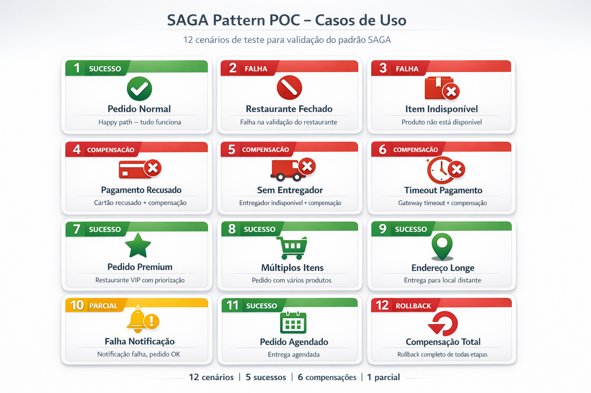

# Scripts de Teste - Casos de Uso

Este diretório contém scripts para facilitar o teste dos 12 casos de uso da POC SAGA.

---

## Arquivos Disponíveis

| Arquivo | Descrição | Plataforma |
|---------|-----------|------------|
| `testar-casos-de-uso.ps1` | Script PowerShell | Windows |
| `testar-casos-de-uso.sh` | Script Bash | Linux/Mac |

---

## Como Usar

### **Windows (PowerShell)**

#### Testar todos os casos de uso:
```powershell
cd C:\Projetos\saga-poc-dotnet\docs\scripts
.\testar-casos-de-uso.ps1
```

#### Testar apenas um caso específico:
```powershell
.\testar-casos-de-uso.ps1 1    # Testa apenas o Caso 1
.\testar-casos-de-uso.ps1 5    # Testa apenas o Caso 5
.\testar-casos-de-uso.ps1 12   # Testa apenas o Caso 12
```

#### Alterar a URL da API:
```powershell
.\testar-casos-de-uso.ps1 -BaseUrl "http://localhost:8080"
```

---

### **Linux/Mac (Bash)**

#### Dar permissão de execução (primeira vez):
```bash
chmod +x testar-casos-de-uso.sh
```

#### Testar todos os casos de uso:
```bash
cd /c/Projetos/saga-poc-dotnet/docs/scripts
./testar-casos-de-uso.sh
```

#### Testar apenas um caso específico:
```bash
./testar-casos-de-uso.sh 1    # Testa apenas o Caso 1
./testar-casos-de-uso.sh 5    # Testa apenas o Caso 5
./testar-casos-de-uso.sh 12   # Testa apenas o Caso 12
```

#### Alterar a URL da API:
```bash
BASE_URL="http://localhost:8080" ./testar-casos-de-uso.sh
```



## Pré-requisitos

### Antes de executar os scripts:

1. **Inicie todos os serviços da POC**:
   ```bash
   # Terminal 1: Orquestrador
   cd src/SagaPoc.Orquestrador
   dotnet run

   # Terminal 2: API
   cd src/SagaPoc.Api
   dotnet run

   # Terminal 3: Serviço Restaurante
   cd src/SagaPoc.ServicoRestaurante
   dotnet run

   # Terminal 4: Serviço Pagamento
   cd src/SagaPoc.ServicoPagamento
   dotnet run

   # Terminal 5: Serviço Entregador
   cd src/SagaPoc.ServicoEntregador
   dotnet run

   # Terminal 6: Serviço Notificação
   cd src/SagaPoc.ServicoNotificacao
   dotnet run
   ```

2. **Verifique se a API está respondendo**:
   ```bash
   curl http://localhost:5000/health
   ```

3. **Configure o Azure Service Bus** (veja [plano-execucao.md](../plano-execucao.md))

---

## Observando os Resultados

### Nos Scripts

Os scripts mostram:
- Payload enviado
- Resposta da API (PedidoId, Status)
- HTTP Status Code

### Nos Logs dos Serviços

Observe os terminais onde os serviços estão rodando para ver:
- Transições de estado da SAGA
- Mensagens sendo processadas
- Compensações sendo executadas
- Estado final do pedido

**Exemplo de log (caso de sucesso)**:
```
[INFO] Validando pedido no restaurante REST001
[INFO] Pedido validado. ValorTotal: R$ 45,90
[INFO] Processando pagamento
[INFO] Pagamento aprovado. TransacaoId: TXN_abc123
[INFO] Alocando entregador
[INFO] Entregador ENT001 alocado
[INFO] SAGA finalizada com sucesso
```

**Exemplo de log (com compensação)**:
```
[INFO] Pedido validado
[INFO] Pagamento aprovado. TransacaoId: TXN_xyz789
[WARN] Nenhum entregador disponível
[WARN] ⬅️ COMPENSAÇÃO: Estornando pagamento TXN_xyz789
[INFO] Pagamento estornado
[WARN] ⬅️ COMPENSAÇÃO: Cancelando pedido no restaurante
[INFO] SAGA finalizada com cancelamento
```

---

## Troubleshooting

### Erro: "Invoke-WebRequest não reconhecido" (PowerShell)

**Problema**: PowerShell 5.1 ou inferior.

**Solução**: Use PowerShell 7+:
```powershell
winget install Microsoft.PowerShell
```

Ou altere o script para usar `Invoke-WebRequest` ao invés de `Invoke-RestMethod`.

---

### Erro: "Connection refused" ou "Failed to connect"

**Problema**: API não está rodando ou está em porta diferente.

**Soluções**:
1. Verifique se a API está rodando:
   ```bash
   dotnet run --project src/SagaPoc.Api
   ```

2. Verifique a porta no arquivo `src/SagaPoc.Api/Properties/launchSettings.json`

3. Especifique a URL correta:
   ```powershell
   .\testar-casos-de-uso.ps1 -BaseUrl "http://localhost:7000"
   ```

---

### Erro: "jq: command not found" (Linux/Mac)

**Problema**: `jq` não está instalado (usado para formatar JSON no script bash).

**Solução**: Instale o `jq`:
```bash
# Ubuntu/Debian
sudo apt-get install jq

# Mac
brew install jq

# Ou remova a formatação JSON do script
# (os dados serão exibidos sem formatação, mas funcionarão)
```

---

## Mais Informações

- **Casos de Uso Detalhados**: [casos-uso.md](../casos-uso.md)
- **Arquitetura da POC**: [arquitetura.md](../arquitetura.md)
- **Plano de Execução**: [plano-execucao.md](../plano-execucao.md)

---

**Última atualização**: 2026-01-07
